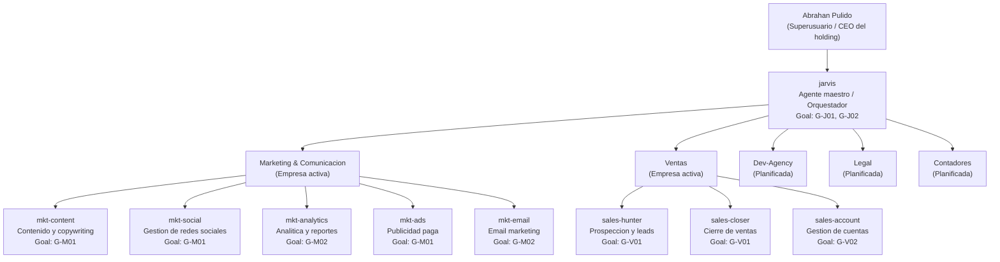

# Organigrama del holding Jarvis

Representacion visual de la jerarquia operativa. Fuente: [COMPANIES.md](COMPANIES.md).

---

---

## Leyenda

- **Linea solida**: reporta a / es orquestado por.
- **Goal: G-XXX**: meta principal del agente (ver [GOALS.md](GOALS.md)).
- **Empresas planificadas**: sin agentes ni workspace activos; se crearan cuando el CEO lo autorice.

## Actualizacion

Al agregar agentes o empresas, actualizar este diagrama y [COMPANIES.md](COMPANIES.md) simultaneamente.
