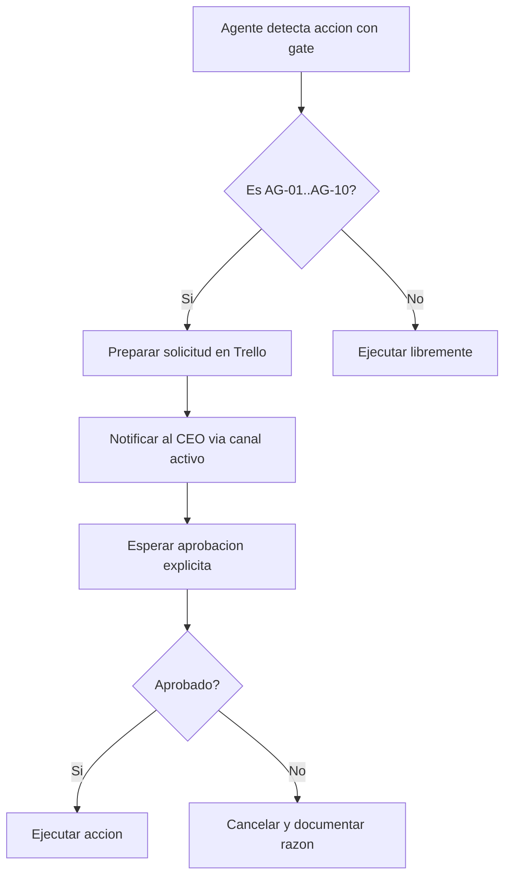

# Puertas de aprobacion (Approval Gates)

**Inspirado en:** Paperclip AI (governance: acciones que requieren aprobacion humana antes de ejecutarse).  
**Aplica a:** todos los agentes del ecosistema Jarvis.  
**Ultima actualizacion:** abril 2026.

---

## Principio

Los agentes operan con autonomia dentro de limites definidos. Cualquier accion que **comprometa recursos, reputacion o datos** debe pasar por aprobacion explicita del CEO (superusuario) antes de ejecutarse.

## Tabla de approval gates

| ID | Accion | Agentes afectados | Nivel | Como solicitar |
|----|--------|--------------------|-------|----------------|
| `AG-01` | Enviar propuesta comercial a cliente | sales-hunter, sales-closer | CEO | Tarjeta en Trello "Pendiente aprobacion" + mensaje al CEO |
| `AG-02` | Comprometer precio, descuento o condiciones contractuales | sales-closer, sales-account | CEO | Dossier del cliente con propuesta adjunta |
| `AG-03` | Publicar contenido en redes sociales | mkt-content, mkt-social | CEO | Borrador en Trello + preview antes de publicar |
| `AG-04` | Envio masivo de email (>10 destinatarios) | mkt-email | CEO | Lista de destinatarios + contenido en borrador |
| `AG-05` | Ejecutar pagos o comprometer presupuesto | cualquiera | CEO | Monto, proveedor y justificacion |
| `AG-06` | Crear/eliminar tableros de Trello o canales de Discord | jarvis | CEO | Propuesta con nombre y proposito |
| `AG-07` | Modificar openclaw.json (config del gateway) | jarvis | CEO | Diff de cambios propuestos |
| `AG-08` | Compartir datos de clientes fuera del ecosistema | cualquiera | CEO | Descripcion de que datos, a quien y por que |
| `AG-09` | Instalar dependencias o skills nuevos | jarvis | CEO | Nombre del paquete + justificacion |
| `AG-10` | Acciones destructivas (rm, borrar repos, revocar accesos) | cualquiera | CEO | Descripcion detallada + confirmacion |

## Niveles de aprobacion

| Nivel | Quien aprueba | Tiempo de respuesta esperado |
|-------|---------------|------------------------------|
| **CEO** | Superusuario (Abrahan) | Inmediato o en siguiente sesion |
| **Supervisor** | CEO/Supervisor de la empresa (futuro) | Cuando se asignen personas reales |

## Flujo de aprobacion

## Reglas para agentes

1. **Ante la duda, preguntar.** Si una accion no esta en la tabla pero podria tener impacto, tratarla como gate.
2. **No asumir aprobacion.** Un "ok" en chat casual no cuenta. Debe ser respuesta explicita a la solicitud.
3. **Documentar siempre.** Toda solicitud y su resultado (aprobado/rechazado) debe quedar en Trello o en `memory/`.
4. **No acumular solicitudes.** Cada gate es independiente; no agrupar varias acciones en una sola solicitud.

## Donde se aplica

Estas reglas estan referenciadas en:

- `agents/jarvis/AGENTS.md` — seccion "Gobierno del holding".
- `agents/ventas/AGENTS.md` — seccion "Lineas rojas".
- `agents/marketing/AGENTS.md` — seccion "Lineas rojas".
- `docs/GOBIERNO_JARVIS_V2.md` — modelo operativo general.

## Excepciones

- Heartbeats internos (`target: "none"`) no requieren aprobacion.
- Lectura de archivos, exploracion y busqueda son siempre libres.
- Actualizacion de `memory/` y `MEMORY.md` es libre.
- `git add/commit` dentro del repo del ecosistema es libre (push requiere discrecion).
