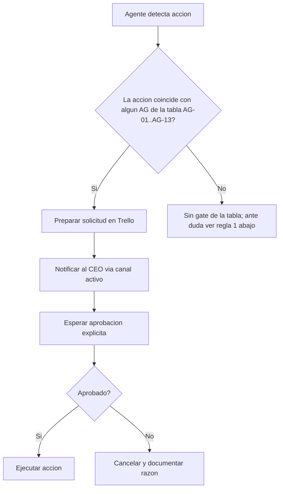
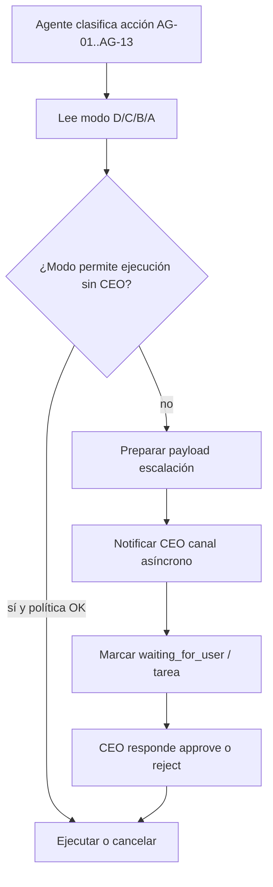

# Puertas de aprobacion (Approval Gates)

**Inspirado en:** Paperclip AI (governance: acciones que requieren aprobacion humana antes de ejecutarse).  
**Aplica a:** todos los agentes del ecosistema Jarvis.  
**Ultima actualizacion:** abril 2026 (aclaracion AG-03: publicacion vs borrador Canva automatico).

---

## Principio

Los agentes operan con autonomia dentro de limites definidos. Cualquier accion que **comprometa recursos, reputacion o datos** debe pasar por aprobacion explicita del CEO (superusuario) antes de ejecutarse.

## Tabla de approval gates

| ID | Accion | Agentes afectados | Nivel | Como solicitar |
|----|--------|--------------------|-------|----------------|
| `AG-01` | Enviar propuesta comercial a cliente | sales-hunter, sales-closer | CEO | Tarjeta en Trello "Pendiente aprobacion" + mensaje al CEO |
| `AG-02` | Comprometer precio, descuento o condiciones contractuales | sales-closer, sales-account | CEO | Dossier del cliente con propuesta adjunta |
| `AG-03` | **Publicar** contenido en redes sociales (subir/publicar en la plataforma) | mkt-content, mkt-social, jarvis | CEO | Borrador en Trello + preview antes de publicar |
| `AG-04` | Envio masivo de email (>10 destinatarios) | mkt-email | CEO | Lista de destinatarios + contenido en borrador |
| `AG-05` | Ejecutar pagos o comprometer presupuesto | cualquiera | CEO | Monto, proveedor y justificacion |
| `AG-06` | Crear/eliminar tableros de Trello o canales de Discord | jarvis | CEO | Propuesta con nombre y proposito |
| `AG-07` | Modificar openclaw.json (config del gateway) | jarvis | CEO | Diff de cambios propuestos |
| `AG-08` | Compartir datos de clientes fuera del ecosistema | cualquiera | CEO | Descripcion de que datos, a quien y por que |
| `AG-09` | Instalar dependencias o skills nuevos | jarvis | CEO | Nombre del paquete + justificacion |
| `AG-10` | Acciones destructivas (rm, borrar repos, revocar accesos) | cualquiera | CEO | Descripcion detallada + confirmacion |
| `AG-11` | Añadir dominio a **BROWSER_PLAYWRIGHT_ALLOW** o automatizar sitio (login bancos, portales, CRM sin API) | jarvis, dev-agency | CEO | Nombre de dominio + riesgo + prueba en staging / dry-run; ver `skills/browser-playwright/SKILL.md` |
| `AG-12` | **Publicar** carrusel/reel/video a un canal externo (Instagram, TikTok, Facebook, YouTube, LinkedIn) | marketing, jarvis | CEO | Manifest `index.json` + preview del asset + horario propuesto. Sustituye / complementa AG-03 cuando el contenido fue generado por el pipeline RRSS local. |
| `AG-13` | Usar **IA generativa** (imagen, voz, video) en assets que se vayan a publicar o entregar al cliente | marketing, dev-agency, jarvis | CEO | Lista de assets IA + manifest con `ai_used:true` + nota legal sobre derechos / atribucion. Se acumula con AG-12 si ademas se publica. |

## Niveles de aprobacion

| Nivel | Quien aprueba | Tiempo de respuesta esperado |
|-------|---------------|------------------------------|
| **CEO** | Superusuario (Abrahan) | Inmediato o en siguiente sesion |
| **Supervisor** | CEO/Supervisor de la empresa (futuro) | Cuando se asignen personas reales |

## Flujo de aprobacion



## Modos de autonomía (A / B / C / D) y matriz AG × Modo

Los gates anteriores son la **verdad legal** del ecosistema. El modo de autonomía (`JARVIS_AUTONOMY_MODE`, ver [`AUTONOMIA_MODOS.md`](AUTONOMIA_MODOS.md)) define **cuánto puede hacer el agente solo** antes de escalar al CEO por **Telegram / WhatsApp / Trello** según [`ESCALACION_ASYNC.md`](ESCALACION_ASYNC.md).

- **Default recomendado:** **D** (control total; mismo comportamiento que antes de existir modos).
- **Matriz detallada:** tabla AG × modo en [`AUTONOMIA_MODOS.md`](AUTONOMIA_MODOS.md#matriz-ag--modo-resumen).
- **Análisis upstream ClawWork (ideas vs código):** [`CLAWWORK_FORENSE.md`](CLAWWORK_FORENSE.md).

### Flujo asíncrono (escalar → esperar → continuar)



## Reglas para agentes

1. **Ante la duda, preguntar.** Si una accion no esta en la tabla pero podria tener impacto, tratarla como gate.
2. **No asumir aprobacion.** Un "ok" en chat casual no cuenta. Debe ser respuesta explicita a la solicitud.
3. **Documentar siempre.** Toda solicitud y su resultado (aprobado/rechazado) debe quedar en Trello o en `memory/`.
4. **No acumular solicitudes.** Cada gate es independiente; no agrupar varias acciones en una sola solicitud.

## Donde se aplica

Estas reglas estan referenciadas en:

- `agents/jarvis/AGENTS.md` — seccion "Gobierno del holding".
- `agents/ventas/AGENTS.md` — seccion "Lineas rojas".
- `agents/marketing/AGENTS.md` — seccion "Lineas rojas".
- `docs/GOBIERNO_JARVIS_V2.md` — modelo operativo general.

## Aclaracion: creacion automatica de diseno vs publicacion

- **Generar** copy, **crear** lienzo en Canva (API/Composio/MCP) y **exportar** PNG/PDF para revision **no** es lo mismo que **publicar** en Instagram u otra red.
- **AG-03** aplica al acto de **publicacion** (o programacion de publicacion) visible para la audiencia, no al mero borrador tecnico en Canva ni al archivo exportado en el chat.
- Si el superusuario quiere que el pipeline copy+Canva+export sea **100% automatico sin intervencion** hasta el archivo listo, eso es compatible con esta tabla siempre que **no** se ejecute la publicacion sin pasar por AG-03 (salvo politica explicita del CEO).

## Anexo: skills de marketing (`agents/marketing/skills/`)

Las skills importadas desde [coreyhaines31/marketingskills](https://github.com/coreyhaines31/marketingskills) incluyen en su **Guía Jarvis-ecosystem** que gates aplican según la tarea. Referencia rapida (detalle en cada `SKILL.md`):

| Gate | Skills que lo mencionan explicitamente (lista no exhaustiva) |
|------|----------------------------------------------------------------|
| **AG-11** | `customer-research`, `competitor-profiling`, `seo-audit`, `programmatic-seo` (si hay automatizacion/navegacion a dominios no permitidos). |
| **AG-12** | `social-content`, `email-sequence`, `paid-ads`, `directory-submissions`, `referral-program`, `launch-strategy` (cuando implique publicacion o envio masivo visible). |
| **AG-13** | `image`, `ad-creative`, `video`, `social-content` (cuando use IA generativa en assets para entregar/publicar). |

Matriz completa: [`docs/RESEARCH_MARKETING_SKILLS.md`](RESEARCH_MARKETING_SKILLS.md).

### Comandos reales (trazabilidad / handoff)

Ejecutar desde la raíz `jarvis-ecosystem/` (ver también cada `SKILL.md` de marketing):

```bash
# Registrar inicio de trabajo ligado a dossier
bash skills/global/activity-log/bin/activity-log start \
  --agent mkt-content \
  --title "Breve descripción" \
  --dossier <DOSSIER_ID> \
  --ref marketing

# Evento intermedio (milestone)
bash skills/global/activity-log/bin/activity-log event \
  --task <TASK_ID> \
  --agent mkt-content \
  --kind milestone \
  --note "Estado / entregable"

# Handoff con contrato validado por schema
bash skills/global/handoff/bin/handoff create \
  --from mkt-content \
  --to mkt-social \
  --schema copy-to-design \
  --task <TASK_ID> \
  --payload-file /tmp/handoff-payload.json

bash skills/global/activity-log/bin/activity-log end \
  --task <TASK_ID> \
  --note "Cierre / listo para revisión"
```

Schemas disponibles: `bash skills/global/handoff/bin/handoff schemas`.

## Excepciones

- Heartbeats internos (`target: "none"`) no requieren aprobacion.
- Lectura de archivos, exploracion y busqueda son siempre libres.
- Actualizacion de `memory/` y `MEMORY.md` es libre.
- `git add/commit` dentro del repo del ecosistema es libre (push requiere discrecion).
