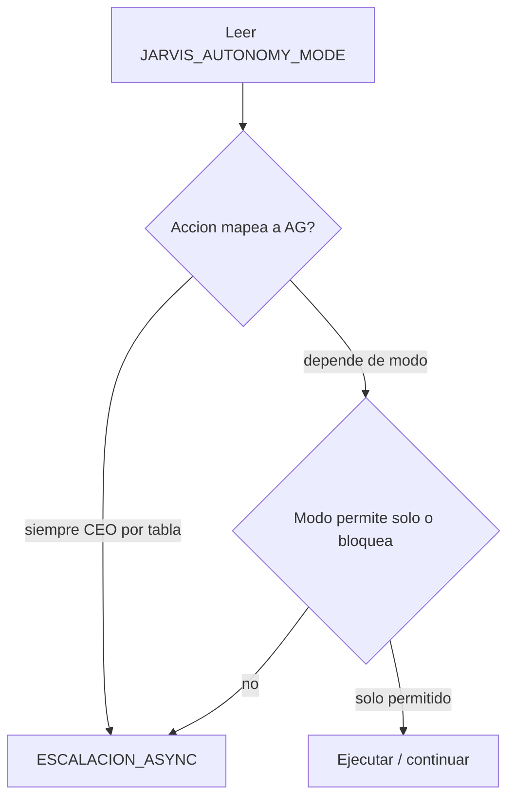

# Modos de autonomía Jarvis (A / B / C / D)

**Objetivo:** permitir trabajo **sin supervisión continua** del CEO, con **escalación asíncrona** (Telegram, WhatsApp, etc.) cuando la política o los gates lo exijan.

**Default:** **D** — nadie cambia comportamiento hasta que el operador suba el modo en `~/.openclaw/.env` y/o en `MEMORY.md` del agente.

---

## Frases breves (para que el agente las diga al usuario)

Usar tal cual o parafrasear sin cambiar el sentido — van **siempre** en la misma respuesta que la declaración del modo activo:

| Modo | Descripción en una frase |
|------|---------------------------|
| **D** | Máximo control: cada gate AG pasa por solicitud explícita al CEO como hasta ahora. |
| **C** | Trabajo solo en research y borradores locales; cualquier cosa visible fuera (RRSS, mails masivos, publicar) la consulto por Telegram/WhatsApp antes. |
| **B** | Como C, y además puedo automatizar pasos repetibles de bajo riesgo dentro del dossier que ya aprobaste (sin publicar al mundo sin tu OK). |
| **A** | Piloto: máxima autonomía solo en horario y cuentas/rutas en lista blanca; fuera de eso aplico reglas tipo C o D. |

---

## Definición de modos

| Modo | Nombre | Comportamiento |
|------|--------|----------------|
| **D** | Control total (actual) | Respeta **literalmente** AG-01…AG-13. Cada gate requiere solicitud explícita + aprobación CEO según [APPROVAL_GATES.md](APPROVAL_GATES.md). |
| **C** | Async estricto | Autónomo en **research**, **borradores** y archivos **locales al repo/dossier**. Cualquier **salida al mundo exterior** (RRSS, email masivo, pagos, APIs públicas, publicación en Canva “live”) **escala** según [ESCALACION_ASYNC.md](ESCALACION_ASYNC.md). |
| **B** | Async amplio | Como **C**, más: puede ejecutar **acciones repetibles de bajo riesgo** dentro de un **dossier ya aprobado** (p. ej. actualizar copy en `out/`, registrar eventos en activity-log, handoffs internos sin publicar). |
| **A** | Piloto acotado | Autonomía alta solo dentro de **ventana horaria** + **lista blanca** (cuentas, tableros, rutas). Fuera de ventana o fuera de lista blanca → se comporta como **C** (o **D** si el operador lo fija en política). |

---

## Cómo se configura

1. **Host (recomendado):** en `~/.openclaw/.env` (no commitear):
   ```bash
   JARVIS_AUTONOMY_MODE=D   # o A, B, C
   ```
2. **Por agente (documental):** campo `autonomy_mode` en `agents/<empresa>/MEMORY.md` (debe coincidir con el modo efectivo o documentar excepción).
3. **Al iniciar sesión / tarea:** el agente **declara** el modo activo (ver [`skills/global/core-prompt.md`](../skills/global/core-prompt.md)).

---

## Matriz AG × Modo (resumen)

Leyenda: **Solo** = puede completar sin CEO si el modo lo permite y no hay otro bloqueo | **Escala** = debe usar flujo [ESCALACION_ASYNC.md](ESCALACION_ASYNC.md) | **Siempre CEO** = gate no se relaja por modo (salvo política escrita del CEO).

| Gate | D | C | B | A (dentro whitelist+ventana) |
|------|---|---|---|------------------------------|
| AG-01 Propuesta comercial | Siempre CEO | Escala | Escala | Escala (salvo dossier con propuesta pre-aprobada explícita en JSON) |
| AG-02 Precio/contrato | Siempre CEO | Escala | Escala | Escala |
| AG-03 Publicar RRSS | Siempre CEO | Escala | Escala | Solo si cuenta/ruta en whitelist **y** ventana activa |
| AG-04 Email masivo | Siempre CEO | Escala | Escala | Escala |
| AG-05 Pagos | Siempre CEO | Siempre CEO | Siempre CEO | Siempre CEO |
| AG-06 Trello/Discord create-delete | Siempre CEO | Escala | Escala | Solo tableros/canales en whitelist |
| AG-07 openclaw.json | Siempre CEO | Siempre CEO | Siempre CEO | Siempre CEO |
| AG-08 Datos fuera del ecosistema | Siempre CEO | Escala | Escala | Escala |
| AG-09 Instalar deps/skills | Siempre CEO | Escala | Escala | Escala |
| AG-10 Destructivo | Siempre CEO | Siempre CEO | Siempre CEO | Siempre CEO |
| AG-11 browser-playwright nuevos dominios | Siempre CEO | Escala | Escala si fuera allowlist | Solo dominios en whitelist |
| AG-12 Publicar carrusel/reel/video externo | Siempre CEO | Escala | Escala | Solo si canal en whitelist + ventana |
| AG-13 IA en assets a publicar/entregar | Siempre CEO | Escala | Escala | Escala (AG-13 no se “auto-aprueba”) |

**Regla de oro:** **AG-05, AG-07, AG-10** y **AG-13** no se debilitan por modos B/C/A sin **política escrita** del CEO. **AG-13** siempre implica trazabilidad y revisión humana antes de entrega/publicación final.

---

## Relación con cost footer

En cualquier modo, al cerrar un turno relevante el agente puede añadir línea de accountability económica (ver [`economic-accountability-ops`](../skills/global/economic-accountability-ops/SKILL.md)). El modo **no** sustituye gates.

---

## Diagrama: modo y gate



---

## Historial

- **2026-04-28:** Documento inicial + matriz + enlace a forense ClawWork ([CLAWWORK_FORENSE.md](CLAWWORK_FORENSE.md)).
