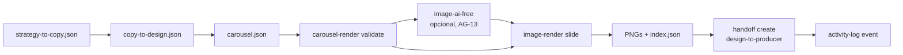

# Pipeline gratis y local — Carruseles RRSS

**Status:** v1, abril 2026.
**Costo:** USD 0. **GPU:** no requerida.
**Skills involucradas:** [`brand-kit`](../skills/brand-kit/SKILL.md), [`image-ai-free`](../skills/image-ai-free/SKILL.md), [`image-render`](../skills/image-render/SKILL.md), [`carousel-render`](../skills/carousel-render/SKILL.md), [`activity-log`](../skills/global/activity-log/SKILL.md), [`handoff`](../skills/global/handoff/SKILL.md).

> Para el panorama completo (incluido video) ver [PIPELINE_CONTENIDO_RRSS.md](PIPELINE_CONTENIDO_RRSS.md). Este doc se enfoca solo en carruseles.

---

## 1. Que produce

PNGs listos para publicar (1080x1080, 1080x1350, 1080x1920, 1200x630), agrupados en una carpeta por carrusel con manifiesto auditable.

```
out/<brand_id>/<slug>/
├── 01.png ... NN.png
└── index.json   <- generated_at, brand, format, sha de cada PNG, ai_used
```

## 2. Stack 100% gratis

| Capa | Herramienta | Costo | Local | Notas |
|---|---|---|---|---|
| Branding | brand-kit + JSON | 0 | si | reutilizable por cliente |
| Layouts | Pillow (Python) | 0 | si | DejaVu fallback, fc-match opcional |
| Fondos IA | Pollinations.ai | 0 | no | API publica con cache local sha1 |
| Orquestacion | bash + jq | 0 | si | sin daemons |
| Auditoria | activity-log | 0 | si | jsonl append-only |

**Razon de eleccion:** Pillow es estable, ligero, sin dependencia de GPU. Pollinations no requiere key y entrega resultados aceptables para fondos abstractos. El resto es estandar Unix.

## 3. Flujo



## 4. Ejemplo end-to-end

### 4.1. Definir branding (una sola vez por cliente)

```bash
cd /var/www/clawvis-openclaw/jarvis-ecosystem
skills/brand-kit/bin/brand-kit init --dossier cli-DEMO-rrss
# editar ~/Documents/client-dossiers/cli-DEMO-rrss/brand.json
```

### 4.2. Crear `carousel.json` (lo entrega copy o estrategia)

`templates/carousels/cli-DEMO-rrss/5-errores-marketing.json` ya esta disponible como referencia.

### 4.3. Validar y previsualizar

```bash
skills/carousel-render/bin/carousel-render validate --in templates/carousels/cli-DEMO-rrss/5-errores-marketing.json
skills/carousel-render/bin/carousel-render preview  --in templates/carousels/cli-DEMO-rrss/5-errores-marketing.json
```

### 4.4. Renderizar (con o sin IA)

```bash
# Sin IA (rapido, 100% offline)
skills/carousel-render/bin/carousel-render render \
  --in templates/carousels/cli-DEMO-rrss/5-errores-marketing.json \
  --no-ai

# Con IA (requiere AG-13 y red)
skills/carousel-render/bin/carousel-render render \
  --in templates/carousels/cli-DEMO-rrss/5-errores-marketing.json \
  --task-id task-2026-04-27-rrss
```

Salida de muestra:

```
[01/8] hook
[02/8] step
[03/8] step
...
OK: 8 slides en /var/www/.../out/cli-DEMO-rrss/5-errores-marketing
```

### 4.5. Auditar y handoff

```bash
# Registrar entrega y crear handoff hacia producer/publisher
skills/global/handoff/bin/handoff create \
  --schema design-to-producer \
  --from-agent marketing \
  --to-agent jarvis \
  --task-id task-2026-04-27-rrss \
  --payload-file out/cli-DEMO-rrss/5-errores-marketing/index.json
```

## 5. Tiempos reales medidos (laptop Intel i5, sin GPU)

| Carrusel | Modo | Tiempo total |
|---|---|---|
| 8 slides 1080x1350 | sin IA | ~3 s |
| 8 slides 1080x1350 | con bg IA cada slide | 1-3 min (depende Pollinations) |
| 10 slides 1080x1920 | sin IA | ~4 s |

## 6. Limites honestos

- **Calidad fondo IA**: Pollinations entrega ~80% util para fondos abstractos. Para foto-realismo ir a otro stack (no aplica al free-only).
- **Tipografia**: si la fuente declarada en `brand.json` no esta instalada, se usa DejaVu. Para identidad fuerte poner las TTF en `assets/fonts/` (gitignored).
- **Logo**: ruta debe ser absoluta o relativa al repo root. Si no existe, se omite sin romper render.
- **Reproducibilidad**: misma `seed` con misma prompt da mismo resultado en Pollinations (testeado). Sin seed, varia entre runs.

## 7. Approval Gates aplicables

| Gate | Cuando | Detalle |
|---|---|---|
| **AG-12** | Antes de publicar el carrusel a un canal externo | [APPROVAL_GATES.md](APPROVAL_GATES.md) |
| **AG-13** | Si `ai_assets: true` (Pollinations o cualquier IA generativa) | idem |

`ai_used` queda registrado en `index.json` para auditoria.

## 8. Roadmap corto

- [ ] Soporte de export a `.zip` listo para enviar a cliente.
- [ ] Hook a Imagemagick / Pillow para generar mosaico preview en formato 3x3.
- [ ] Modo `theme=cinematic|editorial|playful` para variar layouts.
- [ ] Soporte de reglas tipograficas avanzadas (kerning manual por idioma).

## 9. Como integrar el pipeline en agentes

| Agente | Responsabilidad |
|---|---|
| `marketing` | dueño del proceso, valida brief, dispara `carousel-render render` |
| `jarvis` | aprueba AG-12/AG-13, supervisa via `coordinator status` |
| `dev-agency` | mejora skills (templates, soporte de fuentes locales) |

Ver el contrato detallado en [COORDINACION_AGENTES.md](COORDINACION_AGENTES.md).
