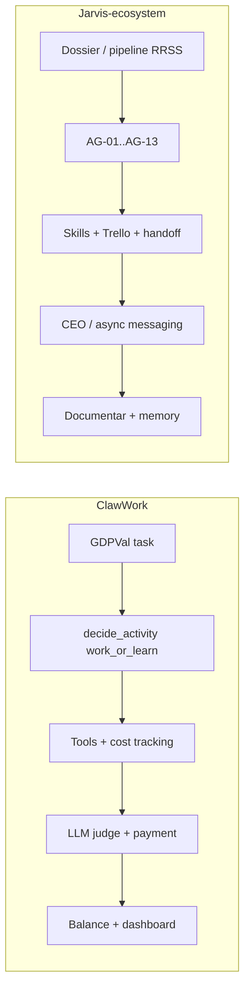

# Análisis forense: HKUDS/ClawWork vs Jarvis-ecosystem

**Fuente upstream:** [HKUDS/ClawWork](https://github.com/HKUDS/ClawWork) (MIT).  
**Revisión documental:** abril 2026.

---

## Qué es ClawWork (realidad técnica)

ClawWork es un **benchmark económico de investigación**: convierte un agente en “coworker” sometido a **presión económica sintética**:

- Partida con saldo inicial (p. ej. **USD 10 ficticios**).
- **Coste por token** en cada turno; ingreso solo si **completa** tareas profesionales evaluadas con LLM-as-judge.
- Dataset **GDPVal** (tareas alineadas con sectores y salarios BLS) — no son clientes reales del holding.
- **Modo “ClawMode”** en el repo: integración con **Nanobot** (config en `~/.nanobot/…`), no con el árbol `~/.openclaw/` del gateway de producción. El marketing “OpenClaw” del README describe intención, no el acoplamiento 1:1.
- **Stack** original: Python (LangChain/LiteLLM), **React** (dashboard), **FastAPI** + WebSocket, sandbox de código (`e2b` u otro), evaluación con rúbricas en `eval/meta_prompts/`.

**Conclusión forense:** ClawWork mide *cómo sobrevive un modelo* bajo reglas de juego; no es un módulo de producto listo para gobernanza empresarial con clientes reales.

---

## Flujos: ClawWork vs Jarvis (alto nivel)

---

## Tabla: aceptar / rechazar / adaptar

| Elemento upstream | Veredicto | Notas |
|-------------------|------------|--------|
| **Cost footer** por turno (`Cost: $X \| Balance: …`) | **Adaptar** | Convención en [`economic-accountability-ops`](../skills/global/economic-accountability-ops/SKILL.md); costes reales vía [`scripts/cost-report.sh`](../scripts/cost-report.sh). |
| **Balance / ingreso simbólico** | **Adaptar** | Sin GDPVal ni BLS; opcional `client-dossiers/<id>/economics.json` y campo `economic` en activity-log. |
| **decide_activity(work \| learn)** autónomo | **Rechazar tal cual** | Choca con [APPROVAL_GATES.md](APPROVAL_GATES.md); sustituir por **modos A/B/C/D** en [AUTONOMIA_MODOS.md](AUTONOMIA_MODOS.md). |
| **LLM-as-judge** con rúbricas | **Adaptar** | Skill [`llm-as-judge-ops`](../agents/jarvis/skills/llm-as-judge-ops/SKILL.md); categorías propias (carousel, copy, cold-email). |
| **Nanobot + clawmode_integration** | **No vendorizar** | Segundo runtime; Jarvis usa OpenClaw en `~/.openclaw/`. |
| **livebench/, frontend/, e2b** | **No vendorizar** | Benchmark + infra pesada; fuera del alcance del repo operativo. |
| **Dashboard React** | **Opcional futuro** | Si se necesita UI, diseño aparte; no copiar el frontend de ClawWork. |

---

## Choques con este ecosistema

1. **Gobierno:** Jarvis define **AG-01…AG-13** y CEO como autoridad; ClawWork premia autonomía para maximizar ingreso sintético.
2. **Runtime:** Integración documentada apunta a **Nanobot**; producción aquí es **OpenClaw** ([COHERENCIA_RUNTIME_REPO.md](COHERENCIA_RUNTIME_REPO.md)).
3. **Tareas:** GDPVal ≠ dossiers en `client-dossiers/` ni pipeline RRSS local.
4. **Riesgo legal/marca:** Publicación y uso de IA en assets están gobernados por **AG-03, AG-12, AG-13**; el benchmark no modela responsabilidad contractual por cliente.

---

## Decisión del repo

- **No** se incluye código de ClawWork como dependencia ni submódulo.
- **Sí** se documentan ideas adoptables (cost awareness, rúbricas, escalación async) en docs y skills citadas arriba.
- Evidencia de licencia MIT del upstream: mantener atribución si en el futuro se copian fragmentos textuales de rúbricas (no es el caso en la primera iteración: rúbricas propias).

---

## Enlaces internos

- Modos de autonomía: [AUTONOMIA_MODOS.md](AUTONOMIA_MODOS.md)
- Gates: [APPROVAL_GATES.md](APPROVAL_GATES.md)
- Escalación async: [ESCALACION_ASYNC.md](ESCALACION_ASYNC.md)
