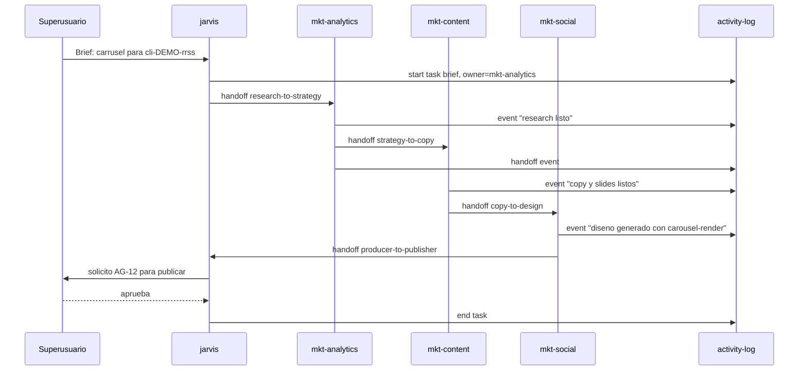

# Coordinacion entre agentes — contrato y flujo

**Fecha:** abril 2026
**Componentes:** activity-log + handoff + coordinator + dossier obligatorio
**Estado:** v1 — implementado en Fase 1 y 2 de [PROPUESTA_MEJORA_JARVIS_V2.md](PROPUESTA_MEJORA_JARVIS_V2.md)

---

## 1. Por que existe esta capa

OpenClaw aisla a cada agente: workspace, sesiones y memoria propios. El RFC "Agent Teams" para comunicacion directa **no esta shipped**. Sin una capa propia, los agentes no saben que hacen los demas y todo depende de que alguien recuerde escribir en Trello, Notion o `MEMORY.md`.

Esta capa, totalmente local en `state/`, soluciona:

- "Quien esta haciendo que ahora mismo."
- "Que handoff esta pendiente de respuesta."
- "Que dossier de cliente lleva sin movimiento N dias."
- "Cuanto tiempo tarda cada agente entre `start` y `end` por tarea."
- "Cuantos handoffs se rechazan y por que."

---

## 2. Modelo de datos

### 2.1 `state/activity-log.jsonl` — append only

Cada linea es un evento JSON con esta forma:

```json
{
  "ts": "2026-04-27T10:30:00Z",
  "agent": "mkt-content",
  "type": "start | end | handoff | event | block | resume",
  "task_id": "task-20260427-103000-abcd",
  "dossier_id": "cli-DEMO-rrss",
  "ref": "carousel|reel|brief|...",
  "actor": "user | agent | cron",
  "payload": { "...": "datos especificos del evento" }
}
```

Campos obligatorios: `ts`, `agent`, `type`, `task_id`. `dossier_id` es obligatorio si el evento toca cliente externo.

### 2.2 `state/tasks/<task-id>.json` — estado vigente

```json
{
  "id": "task-20260427-103000-abcd",
  "title": "Carrusel IG: Lanzamiento producto X",
  "owner": "mkt-content",
  "status": "in_progress | blocked | done | abandoned",
  "dossier_id": "cli-DEMO-rrss",
  "started_at": "2026-04-27T10:30:00Z",
  "ended_at": null,
  "handoffs_open": ["handoff-..."]
}
```

### 2.3 `state/handoffs/<handoff-id>.json` — contrato firmado

```json
{
  "id": "handoff-20260427-1100-xy",
  "from": "mkt-content",
  "to": "mkt-social",
  "schema": "copy-to-design",
  "task_id": "task-...",
  "dossier_id": "cli-DEMO-rrss",
  "created_at": "2026-04-27T11:00:00Z",
  "accepted_at": null,
  "rejected_at": null,
  "rejected_reason": null,
  "payload": {
    "brief_url": "...",
    "hook": "...",
    "slides": [],
    "deliverable_format": "carousel_ig_1080x1350"
  }
}
```

Los `schema` validos viven en [skills/global/handoff/schemas/](../skills/global/handoff/schemas/):

| Schema | De | A | Contenido |
|---|---|---|---|
| `research-to-strategy.json` | mkt-analytics | mkt-content | Audiencia, competencia, oportunidades |
| `strategy-to-copy.json` | mkt-content (estratega) | mkt-content (copy) | Brief creativo, mensajes clave |
| `copy-to-design.json` | mkt-content | mkt-social / carousel-render | Hook, slides en JSON, CTA |
| `design-to-producer.json` | mkt-social | video-short / carousel-render | Plantilla, brand kit, voz |
| `producer-to-publisher.json` | video-short | mkt-social | Asset final + metadata |

---

## 3. Comandos del skill `activity-log`

```bash
# Inicio de tarea (crea task + evento start)
activity-log start \
  --agent mkt-content \
  --title "Carrusel IG lanzamiento" \
  --dossier cli-DEMO-rrss \
  --ref carousel

# Fin de tarea
activity-log end --task task-20260427-103000-abcd

# Evento generico (sin cambiar estado)
activity-log event \
  --agent mkt-content \
  --task task-...-abcd \
  --kind progress \
  --note "5 de 10 slides listos"

# Bloquear tarea
activity-log block --task ... --reason "espera brand kit del cliente"

# Reanudar
activity-log resume --task ...

# Tail de los ultimos N eventos
activity-log tail --n 30

# Filtrar
activity-log filter --agent mkt-content --since 2026-04-26
activity-log filter --dossier cli-DEMO-rrss
activity-log filter --task task-...-abcd
```

**Validacion crucial:** `activity-log start` con `--dossier cli-XXX` falla con codigo 2 si `client-dossiers/cli-XXX/` no existe. Esto fuerza que cada tarea de cliente tenga dossier real (gap historico cerrado).

---

## 4. Comandos del skill `handoff`

```bash
# Crear handoff (valida contra schema)
handoff create \
  --from mkt-content \
  --to mkt-social \
  --schema copy-to-design \
  --task task-...-abcd \
  --payload-file /tmp/payload.json

# Aceptar
handoff accept --id handoff-20260427-1100-xy --by mkt-social

# Rechazar (registra razon)
handoff reject --id handoff-... --by mkt-social --reason "falta brand kit"

# Listar abiertos
handoff list --open
handoff list --to mkt-social --open
handoff list --task task-...-abcd
```

Cada `create | accept | reject` emite tambien evento en `activity-log.jsonl` con `type: handoff`.

---

## 5. Comandos del skill `coordinator`

```bash
# Resumen ejecutivo (para que jarvis lo publique en su canal)
coordinator status

# Ej. salida:
# Activos: 3 tareas en curso (mkt-content, sales-closer, dev-agency).
# Handoffs abiertos: 2 (1 esperando mkt-social >2h, 1 esperando legal >5h).
# Atrancados: 1 (sales-account, "cli-acme-corp", sin actividad >24h).
# Dossiers huerfanos: 0.

# Detalle de un agente
coordinator status --agent mkt-content

# Lo que esta stuck (>X horas)
coordinator stuck --hours 24

# Resumen por dossier
coordinator summary --dossier cli-DEMO-rrss

# Sugerencia de siguiente accion (heuristica simple)
coordinator next --agent mkt-content
```

---

## 6. Pulso automatico (cron)

[automations/jarvis/coordination-pulse.yaml](../automations/jarvis/coordination-pulse.yaml) — cada 4 horas Jarvis ejecuta `coordinator status` y publica resultado por su canal (Discord o Telegram), con AG necesario solo si hay accion correctiva propuesta.

---

## 7. Flujo end-to-end de ejemplo



---

## 8. Integracion con SOUL.md

Cada `agents/<agent>/SOUL.md` añade una linea (en la seccion de protocolo o disciplina):

```markdown
## Disciplina operativa

- Hereda: [skills/global/core-prompt.md](../../skills/global/core-prompt.md)
- Coordinacion: registra `activity-log start` al iniciar tarea, `event` para hitos, `handoff create` al pasar a otro agente, `activity-log end` al cerrar. Detalle: [docs/COORDINACION_AGENTES.md](../../docs/COORDINACION_AGENTES.md).
```

---

## 9. Privacidad y limites

- `state/` queda **fuera** del git tracking salvo plantillas (vease `.gitignore`).
- Datos de cliente solo deben aparecer como `dossier_id` (referencia), nunca como blob completo en `payload`. Para datos sensibles, el `payload` referencia archivo en `client-dossiers/<id>/` y nada mas.
- Los handoffs no llevan secretos (API keys, tokens). Si la tarea los necesita, el destinatario los lee de `.env` por su cuenta.

---

## 10. Roadmap

- v1 (hoy): activity-log, handoff, coordinator, cron pulse, dossier obligatorio.
- v1.1 (futuro): UI ligera tipo Mission Control en HTML local que lea `state/`.
- v1.2: integracion con Trello para reflejar tareas como tarjetas y handoffs como mover columnas.
- v2: si OpenClaw publica RFC Agent Teams, migrar a las primitives nativas conservando los schemas como fuente de verdad.
