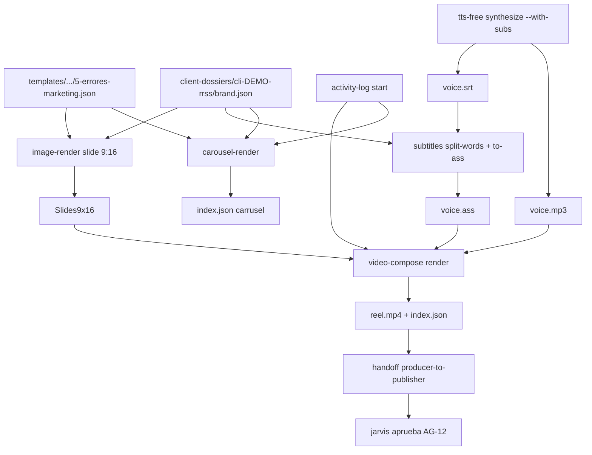

# Demo end-to-end del pipeline RRSS local

> Como jarvis-ecosystem produce un carrusel + un reel cortos para Instagram/TikTok
> usando solo herramientas libres y locales (Pillow, Pollinations.ai, edge-tts, ffmpeg).
> Probado el 2026-04-27 con el cliente demo `cli-DEMO-rrss`.

## 1. Que entrega el demo

A partir de un brief estructurado (`templates/carousels/cli-DEMO-rrss/5-errores-marketing.json`)
y del brand-kit `client-dossiers/cli-DEMO-rrss/brand.json`, el ecosistema produce
sin intervencion humana lo siguiente:

| Asset | Especificacion | Path | Tamano |
|-------|----------------|------|--------|
| Carrusel Instagram/Facebook | 8 slides PNG 1080x1350 | `out/cli-DEMO-rrss/demo-carousel/` | ~600 KB total |
| Reel/TikTok vertical | MP4 H.264 + AAC 1080x1920, ~24 s | `out/cli-DEMO-rrss/demo-reel/reel.mp4` | ~700 KB |
| Voz neuronal es-ES | MP3 mono 24 kHz | `out/cli-DEMO-rrss/demo-reel/voice.mp3` | ~360 KB |
| Subtitulos sincronizados | SRT + ASS con brand-kit | `voice.words.srt`, `voice.ass` | ~3 KB |
| Manifest carrusel | JSON con SHA256 por slide, `ai_used` flag | `out/cli-DEMO-rrss/demo-carousel/index.json` | 3 KB |
| Manifest reel | JSON con SHA, duracion real, slides, `ai_used` | `out/cli-DEMO-rrss/demo-reel/index.json` | 1 KB |
| Handoff a `jarvis` | `producer-to-publisher` con AG-12 pending | `state/handoffs/handoff-*.json` | <1 KB |
| Activity log | 4+ eventos JSON Lines | `state/activity-log.jsonl` | <2 KB |

Tiempo total: ~17 s en una laptop moderna sin GPU dedicada (carrusel <1 s, voz IA ~5 s,
reel ffmpeg ~7 s, resto <1 s cada uno).

## 2. Arquitectura del demo



## 3. Pasos reproducibles

> Requisitos previos: Python 3.12, ffmpeg 7.x, jq, curl.
> El venv de tts-free ya esta en `skills/tts-free/.venv`.
> Las fuentes Inter ya estan en `assets/fonts/`.
> Brand-kit y dossier ya estan en `client-dossiers/cli-DEMO-rrss/`.

### 3.1 Iniciar tarea en el activity-log

```bash
cd jarvis-ecosystem

TASK_OUT=$(bash skills/global/activity-log/bin/activity-log start \
  --agent mkt-content \
  --title "Demo E2E: 5 errores marketing organico" \
  --dossier cli-DEMO-rrss \
  --ref carousel)
TASK_ID=$(echo "$TASK_OUT" | jq -r '.task_id')
```

### 3.2 Renderizar carrusel

```bash
bash skills/carousel-render/bin/carousel-render render \
  --in templates/carousels/cli-DEMO-rrss/5-errores-marketing.json \
  --out-dir out/cli-DEMO-rrss/demo-carousel \
  --task-id "$TASK_ID" \
  --no-ai
```

`--no-ai` rinde sin llamar a Pollinations.ai. Para activar fondos IA quita el flag y
recuerda que esto consume **AG-13** (uso de IA generativa).

### 3.3 Renderizar slides verticales para reel

```bash
mkdir -p out/cli-DEMO-rrss/demo-reel
for i in 01 02 03 04 05 06 08; do
  jq ".slides[$((10#$i - 1))]" templates/carousels/cli-DEMO-rrss/5-errores-marketing.json > /tmp/slide-$i.json
  bash skills/image-render/bin/image-render slide \
    --brand client-dossiers/cli-DEMO-rrss/brand.json \
    --slide /tmp/slide-$i.json \
    --format 1080x1920 \
    --out out/cli-DEMO-rrss/demo-reel/slide-$i.png
done
```

### 3.4 Sintetizar voz IA y subtitulos

```bash
bash skills/tts-free/bin/tts-free synthesize \
  --text "Cinco errores comunes en marketing organico que cuestan clientes. ..." \
  --voice es-ES-AlvaroNeural \
  --out out/cli-DEMO-rrss/demo-reel/voice.mp3 \
  --with-subs

bash skills/subtitles/bin/subtitles split-words \
  --in out/cli-DEMO-rrss/demo-reel/voice.mp3.srt \
  --out out/cli-DEMO-rrss/demo-reel/voice.words.srt \
  --max-words 4

bash skills/subtitles/bin/subtitles to-ass \
  --in out/cli-DEMO-rrss/demo-reel/voice.words.srt \
  --out out/cli-DEMO-rrss/demo-reel/voice.ass \
  --brand cli-DEMO-rrss
```

`tts-free` usa el venv local con `edge-tts==7.2.8`. **AG-13** aplica si la voz se publica.

### 3.5 Componer reel.json y renderizar video

`reel.json` declara slides (con duraciones), audio (voz + musica opcional)
y subtitulos burnt-in. Ver `templates/reels/cli-DEMO-rrss/5-errores-marketing-reel.template.json`
como base.

```bash
bash skills/video-compose/bin/video-compose render \
  --in out/cli-DEMO-rrss/demo-reel/reel.json \
  --out-dir out/cli-DEMO-rrss/demo-reel \
  --task-id "$TASK_ID"
```

`video-compose` produce `reel.mp4` + `index.json` con SHA y `ai_used` derivado del input.

### 3.6 Handoff a jarvis para aprobar publicacion

```bash
cat > /tmp/payload-final.json <<JSON
{
  "asset_path": "out/cli-DEMO-rrss/demo-reel/reel.mp4",
  "manifest_path": "out/cli-DEMO-rrss/demo-reel/index.json",
  "format": "reel_1080x1920",
  "duration_sec": 23.544,
  "channels": ["instagram_reels", "tiktok"],
  "caption": "5 errores de marketing organico (es-ES, voz IA)",
  "hashtags": ["#marketingorganico", "#contentmarketing"],
  "approval": { "ag": "AG-12", "status": "pending" }
}
JSON

bash skills/global/handoff/bin/handoff create \
  --from mkt-content \
  --to jarvis \
  --schema producer-to-publisher \
  --task "$TASK_ID" \
  --payload-file /tmp/payload-final.json
```

El schema valido exige `asset_path`, `format` y `channels` (array). `approval.ag` debe
estar en `AG-03`/`AG-12`/`AG-13`.

### 3.7 Cerrar tarea

```bash
bash skills/global/activity-log/bin/activity-log end \
  --task "$TASK_ID" \
  --note "Demo E2E exitoso"

bash skills/global/coordinator/bin/coordinator summary --dossier cli-DEMO-rrss
```

## 4. Verificaciones del demo (resultado real 2026-04-27)

| Verificacion | Comando | Resultado |
|--------------|---------|-----------|
| Carrusel rendea 8 slides | `ls out/cli-DEMO-rrss/demo-carousel/*.png \| wc -l` | 8 |
| Manifest carrusel reporta `ai_used:false` cuando se usa `--no-ai` | `jq '.ai_used' index.json` | false |
| Reel mp4 dura ~24 s y mide >500 KB | `ffprobe ... reel.mp4` | duration=23.544s, size=698 886 B |
| Voz se sincroniza con SRT | `cat voice.mp3.srt \| head` | 5 cues con timestamps |
| ASS hereda colores del brand-kit | `grep PrimaryColour voice.ass` | usa `font.color.text` |
| Activity-log captura 4 eventos | `wc -l state/activity-log.jsonl` | 4 (start, 2 artifact, end) |
| Handoff producer-to-publisher valido | `handoff create ...` | `handoff_id: handoff-...-63c776` |
| Coordinator resume cronologia | `coordinator summary --dossier cli-DEMO-rrss` | 4 eventos en orden |

## 5. Checklist final de produccion

Antes de publicar cualquier asset producido por este pipeline:

- [ ] **Brief humano:** revisar copy slide por slide, especialmente CTA y llamada legal.
- [ ] **Brand kit actualizado:** `client-dossiers/<id>/brand.json` con colores, fuentes y handles correctos.
- [ ] **Captacion de voz:** si se uso `tts-free`, validar con un humano nativo. Si la voz se publica, registrar **AG-13** en el handoff.
- [ ] **Subtitulos legibles:** abrir `voice.ass` en un reproductor (vlc/mpv) y validar contraste con la zona de "barra de Instagram" (250 px inferiores).
- [ ] **Musica de fondo:** verificar licencia (royalty-free / Creative Commons / contrato).
- [ ] **Manifest revisado:** `index.json` debe tener `sha`, `ai_used` y duracion real coherente.
- [ ] **Aprobacion CEO:** **AG-12** (publicacion) firmada, mas **AG-13** acumulada si hay assets IA.
- [ ] **Channel matrix:** definir orden (Reels primero, luego TikTok, luego repost en Stories).
- [ ] **Schedule:** documentar fecha/hora propuesta en el payload del handoff o en `state/tasks/<task>.json`.
- [ ] **Caption + hashtags:** validar copy localizado al pais del cliente y dentro del limite de la plataforma (Instagram caption <2 200 chars, TikTok <2 200, hashtags <30).
- [ ] **Backup:** confirmar que el out/<dossier>/<asset>/ esta versionado fuera del repo (drive, S3 propio, etc).

## 6. Limitaciones conocidas

1. **Pollinations.ai** (image-ai-free) no garantiza dimensiones exactas; a veces devuelve JPG en vez de PNG. Para assets criticos usar Pillow puro o intervencion humana.
2. **edge-tts** depende del API publico de Microsoft Edge; su disponibilidad puede caer sin aviso.
3. **video-compose** no soporta animaciones complejas (Ken Burns, motion graphics). Para esos casos esta el esqueleto `video-short` (Remotion).
4. **No hay subida automatica** a Instagram/TikTok/YouTube. La publicacion sigue siendo manual y firmada por **AG-12**.
5. **No existe deteccion de copyright musical** automatica. Es responsabilidad humana validar licencias.

## 7. Como adaptarlo a otros clientes

1. Crear `client-dossiers/<cli-XYZ>/brand.json` siguiendo el schema de `brand-kit`.
2. Crear `templates/carousels/<cli-XYZ>/<slug>.json` con las slides del brief.
3. Lanzar:

```bash
TASK_ID=$(bash skills/global/activity-log/bin/activity-log start \
  --agent mkt-content \
  --title "Carrusel <cliente> - <tema>" \
  --dossier cli-XYZ \
  --ref carousel | jq -r '.task_id')

bash skills/carousel-render/bin/carousel-render render \
  --in templates/carousels/cli-XYZ/<slug>.json \
  --out-dir out/cli-XYZ/<slug> \
  --task-id "$TASK_ID"
```

El resto del pipeline (reel + voz + handoff) es identico, cambiando `cli-DEMO-rrss` por
el dossier del cliente real.

## 8. Que falta (futuro corto plazo)

- Plantillas de reel adicionales (testimoniales, "antes/despues", FAQs) en `templates/reels/`.
- Skill `music-library` que catalogue tracks royalty-free locales con metadata de mood y BPM.
- Skill `caption-i18n` que genere variantes ES/EN automaticamente y respete limites de plataforma.
- Integracion (cuando AG-12 + token aprobado) con Buffer/Hootsuite via `browser-playwright` o API directa.
- Pruebas automatizadas (`bats` o similares) sobre el conjunto carousel-render + image-render.

## Referencias cruzadas

- `docs/COORDINACION_AGENTES.md` — sistema activity-log + handoff + coordinator.
- `docs/CAROUSEL_PIPELINE_FREE.md` — detalle del pipeline de carruseles.
- `docs/REELS_TIKTOK_PIPELINE_FREE.md` — detalle del pipeline de reels/TikTok.
- `docs/APPROVAL_GATES.md` — gates AG-12 (publicar) y AG-13 (IA generativa).
- `agents/marketing/SOUL.md` seccion **flujo de produccion RRSS gratuito**.
