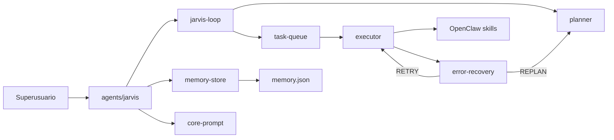

# Análisis forense: FatihMakes/Jarvis-MK37 → jarvis-ecosystem

**Repositorio analizado:** [github.com/FatihMakes/Jarvis-MK37](https://github.com/FatihMakes/Jarvis-MK37)  
**Licencia pública (MK37):** [CC BY-NC 4.0](https://creativecommons.org/licenses/by-nc/4.0/) — personal y no comercial. **No se copia código**; este repositorio re-implementa conceptos con tipos, scripts y documentación propios.

**Fecha de inventario (árbol y tamaños):** derivado de la API de GitHub (`git/trees/main?recursive=1`).

---

## 1. Inventario del repositorio MK37

| Ruta | Tamaño (bytes) | Propósito resumido |
|------|-----------------|--------------------|
| `actions/browser_control.py` | 39 867 | Automatización de navegador (Playwright / flujo tipo browser). |
| `actions/code_helper.py` | 18 687 | Edición y ejecución de código con ayuda del modelo. |
| `actions/computer_control.py` | 16 419 | Teclado, ratón, capturas, búsqueda en pantalla. |
| `actions/computer_settings.py` | 25 449 | Ajustes de sistema (volumen, brillo, WiFi, atajos, energía). |
| `actions/desktop.py` | 16 579 | Escritorio, tareas, organización. |
| `actions/dev_agent.py` | 20 190 | Tareas de desarrollador (agente dev). |
| `actions/file_controller.py` | 18 094 | Archivos, carpetas, disco. |
| `actions/flight_finder.py` | 11 880 | Búsqueda de vuelos. |
| `actions/game_updater.py` | 41 560 | Instalación/actualización de juegos (Steam/Epic, etc.). |
| `actions/open_app.py` | 11 320 | Abrir aplicaciones. |
| `actions/reminder.py` | 10 504 | Recordatorios con fecha. |
| `actions/screen_processor.py` | 13 964 | Visión de pantalla / cámara. |
| `actions/send_message.py` | 7 627 | Envío de mensajes multi-plataforma. |
| `actions/weather_report.py` | 1 399 | Clima por ciudad. |
| `actions/web_search.py` | 4 448 | Búsqueda web (p. ej. DuckDuckGo). |
| `actions/youtube_video.py` | 13 166 | Reproducción, resúmenes, tendencias de YouTube. |
| `agent/error_handler.py` | 6 576 | Clasificación de error → retry / skip / replan / abort. |
| `agent/executor.py` | 15 504 | Ejecución de pasos; incluye flujo de “código generado” (riesgo; no replicado aquí). |
| `agent/planner.py` | 8 540 | Desglose de objetivo en plan de pasos (herramientas fijas, máx. ~5). |
| `agent/task_queue.py` | 7 339 | Cola de tareas con prioridad y hilo de trabajo. |
| `config/__init__.py` | 534 | Config. |
| `core/prompt.txt` | 909 | Protocolo: identidad, flujo de acciones, tool routing, memoria, cierre. |
| `main.py` | 37 628 | Punto de entrada; orquesta voz, UI y bucle principal. |
| `memory/config_manager.py` | 1 354 | `api_keys.json` (Gemini). |
| `memory/memory_manager.py` | 7 380 | `long_term.json` categorías + recorte a ~2200 chars + `format_memory_for_prompt`. |
| `memory/__init__.py` | 16 | Paquete. |
| `readme.md` | 3 374 | Visión, quick start, requisitos, licencia. |
| `requirements.txt` | 634 | Deps: Gemini, Playwright, PyAutoGUI, OpenCV, etc. |
| `setup.py` | 368 | Instalación paquete. |
| `ui.py` | 25 383 | Interfaz (incl. mute, cierre, etc.). |

**Total aprox. en `actions/` + `agent/` + `memory/` + núcleo:** 16 módulos de acción, 4 módulos de agente, 2 de memoria, más `main.py` / `ui.py` / `core/`.

---

## 2. Comparativa de paradigmas

| Dimensión | MK37 | jarvis-ecosystem |
|-----------|------|------------------|
| Runtime | Proceso Python local, voz, visión, control de PC | OpenClaw + ClawHub + ClawFlows; agentes vía `IDENTITY`/`SOUL`/`MEMORY` + skills |
| Autonomía | Bucle voz/terminal + planificador + cola de tareas | Orquestación por YAML (`automations/`) y delegación a skills |
| Memoria | JSON local categorizado y recortado | Mejoras: `memory.json` + `MEMORY.md` como changelog; skill `memory-store` |
| Herramientas | `actions/*.py` monolíticos | Skills reutilizables (gog, trello, tmux, …) + skills nuevos en este plan |
| Riesgo | Generación y ejecución de código (executor) | **Excluido** por alineación con `APPROVAL_GATES` y seguridad |

---

## 3. Tabla: qué tomar / qué descartar / mapeo en este repo

| Origen (MK37) | Decisión | Por qué | Implementación en jarvis-ecosystem |
|---------------|----------|---------|-------------------------------------|
| `core/prompt.txt` | **Tomar idea** | Unifica estilo y routing de herramientas | [`skills/global/core-prompt.md`](../skills/global/core-prompt.md) + herencia en `SOUL.md` |
| `memory/memory_manager.py` | **Tomar idea** | Categorías + límite de contexto | [`skills/global/memory-store/`](../skills/global/memory-store/) + `agents/*/memory.json` |
| `agent/planner` + `task_queue` + `executor` + `error_handler` | **Tomar patrón** (sin copiar código) | Objetivos multi-paso y recuperación | `skills/planner/`, `task-queue/`, `executor/`, `error-recovery/` + `automations/jarvis/loop-orchestrator.yaml` |
| `actions/youtube_video`, `weather_report`, `web_search` | **Tomar capacidad (ligera)** | Enriquece briefings y marketing | `youtube-transcript/`, `weather-report/` (vuelo en backlog) |
| `actions/browser_control` | **Tomar patrón** | Webs sin API | `browser-playwright/` (TS) + dominios bajo aprobación |
| Voz, `mss`, `pyautogui`, control OS | **Descartar** | No es el mandato del holding | — |
| `executor` → código Python generado en runtime | **Descartar** | Riesgo y gates | — |
| Juegos, escritorio, recordatorios locales duplicados | **Descartar** | Categorías ya cubiertas por otras integraciones o fuera de scope | — |

---

## 4. Integración propuesta (diagrama)

---

## 5. Licencia y cumplimiento

- El código y assets de **Jarvis-MK37** no se reutilizan literalmente; se documenta el análisis y se implementan módulos **originales** bajo el marco de tu monorepo.
- Si en el futuro se copia un fragmento concreto de MK37, eso requeriría compatibilidad con CC BY-NC (no adecuada a un uso comercial del holding) — evitarlo.

---

## 6. Checklist por fase (criterios de aceptación)

| Fase | Criterio de “hecho” |
|------|---------------------|
| 0 | Existe `docs/FORENSE_JARVIS_MK37.md` con inventario, tablas, diagrama, checklist. |
| 1 | `memory-store` documentado; `memory.json` inicial por agente; `MEMORY.md` indica memoria operativa vs changelog. |
| 2 | `core-prompt.md` creado; todos los `SOUL.md` referencian herencia; `CLAWFLOWS.md` menciona carga de core. |
| 3 | Skills `youtube-transcript` y `weather-report` con `SKILL.md` + scripts; `morning-briefing` o YAML relacionado invoca pasos; opcional `youtube-trending-watch`. |
| 4 | `browser-playwright` con `SKILL.md`, whitelist y referencia a `AG-` / approval en docs. |
| 5 | `planner`, `task-queue`, `executor`, `error-recovery` + `loop-orchestrator.yaml` coherentes y documentados. |

---

## 7. Referencias externas

- [Repositorio Jarvis-MK37](https://github.com/FatihMakes/Jarvis-MK37)
- [CC BY-NC 4.0](https://creativecommons.org/licenses/by-nc/4.0/)
- Gobernanza local: [APPROVAL_GATES.md](APPROVAL_GATES.md)
