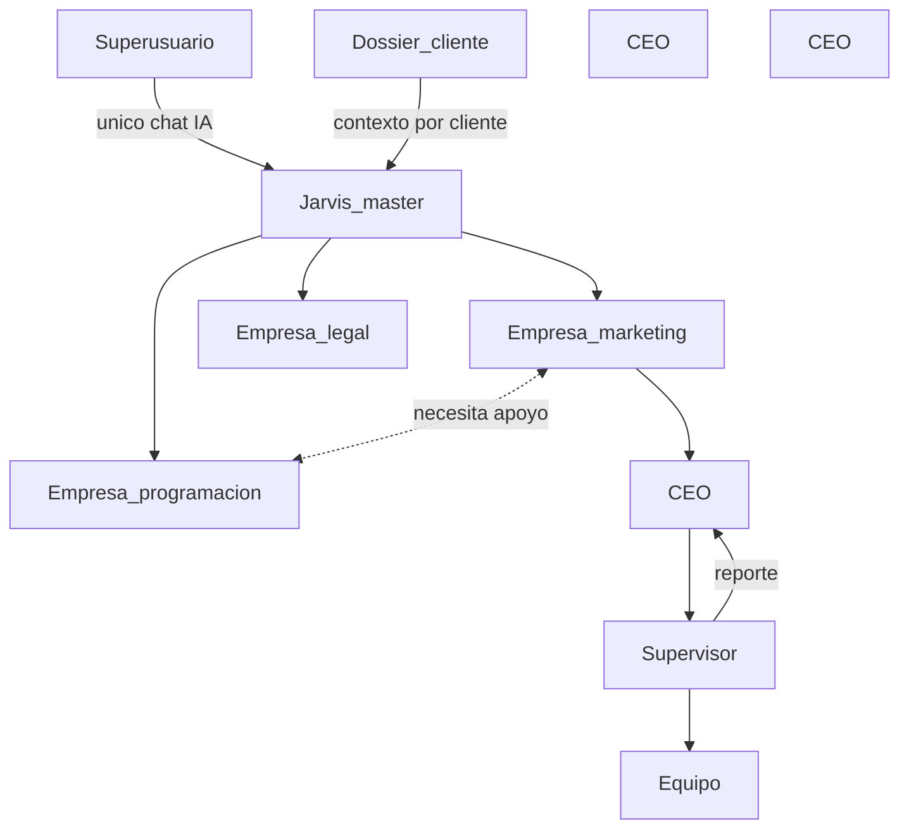

# Gobierno operativo Jarvis v2

**Ámbito:** modelo humano–IA para un holding de empresas (marketing, ventas, desarrollo, legal, contadores, etc.) orquestado por OpenClaw/Jarvis.  
**Última revisión:** abril 2026.

---

## 0. Rol de `jarvis-ecosystem` y de Jarvis como agente maestro

| Concepto | Detalle |
|----------|---------|
| **Módulo `jarvis-ecosystem`** | Es el **módulo completo** donde **Jarvis** es el **agente principal (master)**: gobierno, orquestación y memoria de trabajo del portafolio. |
| **Tu conexión directa** | El **superusuario** es quien mantiene el **diálogo directo** con Jarvis (el punto humano único en el chat con la IA). |
| **Empresas bajo Jarvis** | Por debajo de Jarvis están las **líneas de negocio** que él administra en conjunto: marketing, ventas, agencia de programación, bufete legal, contadores, **u otras**; cada una es una unidad con su **CEO** y su equipo según el tipo de empresa. |
| **Cliente que contrata** | Los **clientes externos** son quienes **contratan servicios** a una o más de esas unidades (ej. diseño + redes, solo programación). Su necesidad se documenta en un **dossier**; **todo el encadenamiento operativo** se entiende **orquestado por Jarvis** (sin saltar pasos informales que rompan trazabilidad). |

Jarvis **no** reemplaza contratos, firmas ni responsabilidad legal de las empresas; **sí** centraliza **quién hace qué**, **en qué orden** y **con qué contexto** (dossiers + herramientas).

---

## 1. Principio de interfaz (chat vs coordinación)

| Regla | Detalle |
|-------|---------|
| **Un solo interlocutor humano en el chat con Jarvis** | Solo el **superusuario** mantiene **conversación** directa con el agente Jarvis (Telegram, etc.). |
| **CEO = interlocutor de negocio por empresa (no obligatoriamente “chat con el bot”)** | En el modelo, **Jarvis interactúa con el rol CEO** vía **asignaciones, tableros, resúmenes y canales** acordados: el CEO es el **dueño de resultado** de su unidad y el punto de contacto humano **hacia fuera** de esa empresa. Si no quieres que los CEOs usen el mismo bot que tú, la coordinación sigue siendo válida por Trello/Discord/informes. |
| **Clientes no usan Jarvis como chat** | Las necesidades del cliente y lo acordado con cada empresa se **formalizan** en **dossiers**, Trello y Discord; **tú** incorporas o apruebas el contexto al hablar con Jarvis para que no se pierda memoria entre clientes. |

Jarvis sigue siendo **orquestador y memoria de trabajo**; no sustituye al CEO ni al supervisor en people management ni en decisiones finales de negocio.

---

## 2. Actores y jerarquía

| Actor | Rol |
|-------|-----|
| **Superusuario** | Único canal humano ↔ Jarvis: estrategia, prioridades, correcciones, síntesis de lo que ocurre en clientes y empresas. |
| **Jarvis** | Orquestación, borradores de tareas, enlaces a herramientas, resúmenes; lee contexto desde dossiers y documentación del workspace cuando existan rutas acordadas. |
| **Cliente (organización externa)** | **No** es usuario del chat de Jarvis. Se representa mediante un **dossier de contexto** (ver [CLIENT_DOSSIER_SCHEMA.md](CLIENT_DOSSIER_SCHEMA.md)): rubro, servicios contratados o deseados, objetivos, notas. |
| **CEO (por empresa)** | Responsable final de **su** empresa (marketing, dev, legal, etc.). Es el **interlocutor de negocio** de esa unidad con el flujo orquestado por Jarvis (tareas, prioridades, handoffs). Recibe **rendición de cuentas** del supervisor. La línea estratégica global la concentras **tú** al hablar con Jarvis; los CEOs ejecutan y reportan por los canales definidos. |
| **Supervisor (por empresa)** | Revisa calidad y avance del equipo; **planifica y mantiene** Trello y la estructura de **Discord** (listas, estados, canales, prioridades); asegura buena organización; **reporta al CEO** en ritmo definido (p. ej. semanal o quincenal: KPIs, bloqueos, riesgos). |

**Comunicación entre empresas:** cuando una unidad necesita a otra (ej. marketing pide landing a programación, o contadores piden criterio legal), el acuerdo se **documenta** (mismo `dossier_id` del cliente, tarjetas enlazadas o ticket de handoff en Trello; ver [CONVENCION_TRELLO_EMPRESA_CLIENTE.md](CONVENCION_TRELLO_EMPRESA_CLIENTE.md)). Jarvis, como orquestador, puede **proponer** la división del trabajo; los CEOs/supervisores **cierran** fechas y alcance en la vida real.

---

## 3. Flujos típicos

| Escenario | Flujo |
|-----------|--------|
| Cliente quiere diseño + redes (una o más empresas) | **Dossier** con `servicios_contratados_o_deseados`; Jarvis orquesta hacia la(s) unidad(es); CEO/supervisor ejecutan en Trello/Discord. |
| Otro cliente quiere solo programación | **Otro dossier** (`dossier_id` distinto); Jarvis separa contextos (no mezcla con el cliente de marketing). |
| Una empresa necesita a otra | Comunicación **entre empresas** resuelta con trazabilidad: mismo cliente = mismo dossier; tarjetas `delegado-a:<empresa>` o espejo entre boards; CEOs alinean entregables. |
| Delegación entre empresas del holding | Tú o el CEO definen el reparto; queda en dossier + Trello (ver [CONVENCION_TRELLO_EMPRESA_CLIENTE.md](CONVENCION_TRELLO_EMPRESA_CLIENTE.md)). |
| Prioridad estratégica | Superusuario → Jarvis → entregables en `~/Documents/` (convención `JARVIS-DOCUMENTS`) / tablas; equipos consumen desde Trello/Discord según plantilla. |

---

## 4. Herramientas y documentación relacionada

| Documento | Contenido |
|-----------|-----------|
| [CLIENT_DOSSIER_SCHEMA.md](CLIENT_DOSSIER_SCHEMA.md) | Esquema mínimo del dossier por cliente (campos, ejemplo JSON). |
| [PLANTILLA_DISCORD_TELEGRAM_EMPRESA.md](PLANTILLA_DISCORD_TELEGRAM_EMPRESA.md) | Roles y canales sugeridos por empresa (sin canal cliente→Jarvis). |
| [CONVENCION_TRELLO_EMPRESA_CLIENTE.md](CONVENCION_TRELLO_EMPRESA_CLIENTE.md) | Tableros, listas, etiquetas y vínculo `dossier_id`. |
| [../../docs/TRELLO_OPENCLAW.md](../../docs/TRELLO_OPENCLAW.md) (monorepo) | Credenciales API Trello y uso desde OpenClaw. |

---

## 5. Fuera de alcance de este documento

- CRM comercial pesado, facturación y contratos legales (solo referencia en dossier si aplica).
- Configuración concreta de `bindings` en `~/.openclaw/openclaw.json` (ver README del ecosistema).
