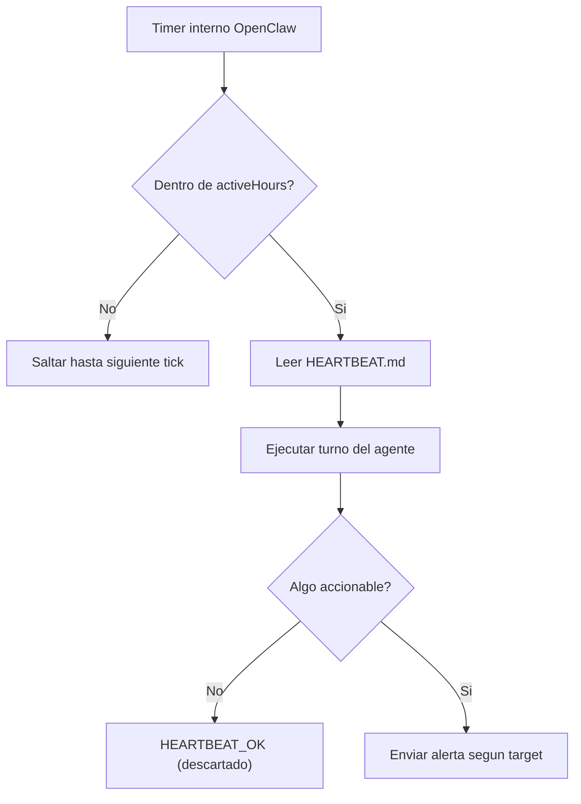

# Heartbeats operativos del ecosistema Jarvis

**Inspirado en:** Paperclip AI (heartbeats como "pulso vital" de agentes autonomos).  
**Motor:** OpenClaw Gateway heartbeat nativo.  
**Ultima actualizacion:** abril 2026.

---

## Que es un heartbeat

Un heartbeat es un turno periodico que OpenClaw ejecuta automaticamente para cada agente configurado. El agente "despierta", lee su `HEARTBEAT.md`, ejecuta las tareas del checklist, y responde:

- **Algo accionable encontrado** -> envia alerta/resumen.
- **Nada que reportar** -> responde `HEARTBEAT_OK` (se descarta silenciosamente).

## Agentes con heartbeat activo

| Agente | Intervalo (plantilla repo) | Horario | Target | HEARTBEAT.md |
|--------|----------------------------|---------|--------|--------------|
| `jarvis` | 30m | 08:00–24:00 VET | none | `agents/jarvis/HEARTBEAT.md` |
| `mkt-content`, `mkt-social`, `mkt-analytics`, `mkt-ads`, `mkt-email`, `mkt-research` | 2h | 09:00–22:00 VET | none | `agents/marketing/HEARTBEAT.md` |
| `sales-hunter` (runtime tipico) | 1h | 08:00–23:00 VET | none | `agents/ventas/HEARTBEAT.md` |
| `sales-*` en plantilla repo | sin heartbeat | — | — | Añadir en `~/.openclaw` si se desea |

**Plantilla:** [`jarvis-ecosystem/openclaw.json`](../openclaw.json). **Runtime:** fusionar a `~/.openclaw/openclaw.json` con OK del CEO (ver [MANUAL_RRSS_JARVIS.md](MANUAL_RRSS_JARVIS.md)).

**Nota:** `target: "none"` significa que el heartbeat corre internamente sin enviar mensajes al CEO. Para activar notificaciones por WhatsApp/Discord/Telegram, cambiar `target` a `"last"` o al canal especifico.

## Configuracion en openclaw.json

Los heartbeats se configuran dentro de cada agente en `agents.list[]`:

```json
{
  "id": "jarvis",
  "heartbeat": {
    "every": "30m",
    "target": "none",
    "lightContext": true,
    "activeHours": {
      "start": "08:00",
      "end": "24:00",
      "timezone": "America/Caracas"
    }
  }
}
```

**Regla importante:** si algun agente en `agents.list` tiene bloque `heartbeat`, **solo esos agentes** ejecutan heartbeats. Los demas quedan excluidos.

## Parametros clave

| Parametro | Descripcion |
|-----------|-------------|
| `every` | Intervalo entre pulsos (`30m`, `1h`, `2h`, etc.). `0m` desactiva. |
| `target` | `none` = solo interno. `last` = ultimo canal usado. `whatsapp`/`discord`/`telegram` = canal especifico. |
| `lightContext` | `true` = solo inyecta HEARTBEAT.md (ahorra tokens). `false` = contexto completo. |
| `activeHours` | Ventana horaria. Fuera de ella, los heartbeats se saltan. |
| `model` | Override del modelo para heartbeats (usar uno ligero para ahorrar). |

## Ciclo de vida de un heartbeat



## Comandos utiles

```bash
# Forzar un heartbeat inmediato (todos los agentes con heartbeat)
openclaw system event --text "Check for urgent follow-ups" --mode now

# Forzar heartbeat en el proximo tick programado
openclaw system event --text "Review pipeline" --mode next-heartbeat

# Ver estado del gateway (confirmar que heartbeats corren)
systemctl --user status openclaw-gateway
```

## Como ajustar

1. **Cambiar frecuencia:** editar `every` en `openclaw.json` + reiniciar gateway.
2. **Cambiar checklist:** editar `HEARTBEAT.md` del workspace del agente (no requiere restart).
3. **Activar notificaciones:** cambiar `target` de `"none"` a `"last"` o `"whatsapp"`.
4. **Desactivar un agente:** quitar el bloque `heartbeat` del agente o poner `"every": "0m"`.

## Relacion con Goals

Cada HEARTBEAT.md referencia los goals del agente (ver [GOALS.md](../GOALS.md)):

- Jarvis: G-J01 (orquestar), G-J02 (memoria).
- Sales-hunter: G-V01 (clientes via Workana).
- Mkt-content: G-M01 (presencia digital), G-M02 (contenido alineado).

## Referencias

- Documentacion oficial: `docs/gateway/heartbeat.md` en el workspace OpenClaw.
- Goals: [../GOALS.md](../GOALS.md).
- Organigrama: [../ORG_CHART.md](../ORG_CHART.md).
- Configuracion: `config/openclaw-home/openclaw.json` en el repo.
