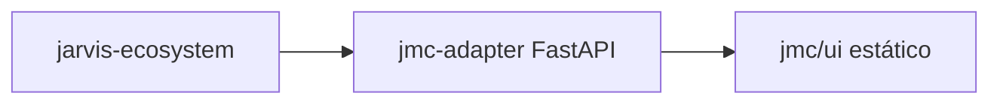

# Jarvis Mission Control (JMC) — diseño y contrato `/v1/`

## Alcance v1

- **Casi read-only:** no escribe `openclaw.json`, `state/tasks|handoffs|…` arbitrario ni dossiers desde la API. **Excepción v1.8:** `POST /v1/modes/current` (Bearer) actualiza `JARVIS_AUTONOMY_MODE` en `os.environ` del proceso y en `~/.openclaw/.env` (ruta bajo `~/.openclaw/`; `tempfile` + `os.replace`). **Excepción Chat (v1.11+):** escritura **controlada** en `state/jmc-inbox/` (o `JMC_CHAT_INBOX_DIR` bajo repo/`state/` salvo `JMC_CHAT_INBOX_ALLOW_EXTERNAL=1`): conversaciones, mensajes del CEO y adjuntos capados vía `POST /v1/chat/*` (+ espejo opcional a Telegram/Discord). **v1.9:** branding opcional en `/v1/health`, lockout por IP tras fallos Bearer, métricas de host y buscadores read-only adicionales (sin DB). **Re-forense ola 2:** lockout también para `X-JMC-Inbound-Secret` fallido (clave distinta de Bearer por IP). **v1.10:** observabilidad profunda (`/v1/health/deep`, `state/agents-stats`, `zombies`, `latency`), cobertura skills/heartbeats, diagnostics/docs lints, sistema extendido, healthchecks externos (whitelist), webhooks/CSP, `GET /v1/auth/status` sin Bearer; UI nuevas, sparkline histórico local, `?view=` / `?tag=`, atajos `g`+letra, tema forzado, wizard de modo (detalle en `JMC_OPERACION.md`).
- **Sin DB:** datos desde repo + `~/.openclaw/` si existe (lectura controlada + la escritura de modo anterior).
- **Bind:** `127.0.0.1` + `JMC_BEARER_TOKEN`.
- **AG-01..AG-13** y matriz de modos desde docs + estado derivado; el **modo efectivo** puede aplicarse vía endpoint acotado.

---

## Arquitectura



- **Adapter:** `jarvis-ecosystem/jmc/adapter/` (FastAPI + uvicorn).
- **UI:** `jarvis-ecosystem/jmc/ui/` servida en `/ui/` vía `StaticFiles`.

---

## Formato de respuesta

Todas las respuestas OK:

```json
{
  "data": {},
  "meta": {
    "version": "v1",
    "generated_at": "2026-04-28T12:00:00+00:00",
    "warnings": []
  }
}
```

Errores:

```json
{
  "error": {
    "code": "string",
    "message": "string"
  }
}
```

Paginación JSONL: query `limit`, `cursor`, `since`, filtros por columna cuando aplique.

---

## Endpoints `GET /v1/...`

| Ruta | Descripción |
|------|-------------|
| `/v1/health` | `{ status, version, build_time, brand }` — `brand` opcional (`JMC_BRAND_*` en env). |
| `/v1/health/deep` | Agregado read-only: JSON `openclaw`, metadatos `activity-log`, `tasks/`, sync automations, judge, etc. |
| `/v1/auth/status` | **Sin Bearer.** Lockout por IP (Bearer e inbound): `{ locked, fails, retry_after_sec, inbound_locked, inbound_fails, inbound_retry_after_sec }` (sin exponer IP al cliente). |
| `/v1/csp-report` | **POST sin Bearer.** Cola circular en memoria (máx. 500) para reportes CSP del navegador. |
| `/v1/diagnostics` | Versiones Python, `repo_root`, `state_dir`, paths efectivos (sin secretos). |
| `/v1/docs/lints` | Coherencia `APPROVAL_GATES.md` ↔ matriz `AUTONOMIA_MODOS.md`. |
| `/v1/state/agents-stats` | Top eventos/errores 24h y 7d por agente (scan `activity-log.jsonl`). |
| `/v1/state/zombies` | Tareas `open` sin eventos recientes (`?hours=` o `JMC_TASK_ZOMBIE_HOURS`). |
| `/v1/state/latency` | Media start→end por agente y dossier. |
| `/v1/skills/coverage` | Conteo `SKILL.md` por workspace declarado en `openclaw.json`. |
| `/v1/heartbeats/coverage` | Agentes en `agents.list` sin bloque `heartbeat`. |
| `/v1/system/cpu-detail` | `psutil.cpu_percent(percpu=True)` cap 64. |
| `/v1/system/proc-summary` | Conteo y RSS agregado (sin PIDs; scan capado). |
| `/v1/system/fs-latency` | `stat` sobre `state/` con tope de latencia informada. |
| `/v1/external/healthchecks` | URLs en `JMC_EXT_HEALTHCHECKS` (CSV `name\|url`); bloqueo IPs privadas salvo loopback con `JMC_EXT_ALLOW_LOCAL=1`. |
| `/v1/webhooks/status` · `/test` · `/notify` | Webhook outbound opcional (`JMC_WEBHOOK_URL`, firma HMAC `JMC_WEBHOOK_SECRET`). |
| `/v1/openclaw/agents` | Lista desde `openclaw.json` (override opcional `JMC_OPENCLAW_JSON_PATH`; si no, `~/.openclaw/openclaw.json` si existe). |
| `/v1/openclaw/skills` | Mapa workspace → skills desde `agents/*/skills/*/SKILL.md` (frontmatter `name`). |
| `/v1/openclaw/automations` | YAML en `automations/` + estado drift (`sync-automations-yaml.sh --check`). |
| `/v1/openclaw/heartbeats` | Por agente: `heartbeat` en `openclaw.json` → `every`, `activeHours`, `target`, `next_due_estimate`, `within_active_hours`. |
| `/v1/openclaw/gateway` | Estado runtime últimas N horas (`?window_hours=24`, 1-168) desde `state/activity-log.jsonl`: `agents[]` (`last_seen`, `events_24h`, `heartbeats_24h`, `silent`, `configured`), `totals.by_kind`, `totals.events_24h`. |
| `/v1/openclaw/cron-timeline` | `?days=1..14` — grilla horaria de ventanas activas por agente (heartbeats) + `runs_recent` (heartbeats en activity-log). |
| `/v1/system/metrics` | CPU, load, RAM, discos (top), red, uptime (`psutil`; caché ~2s). |
| `/v1/runtime/services` | Estado read-only de servicios listados en `JMC_RUNTIME_SERVICES` (CSV): `systemctl` y opcionalmente `pm2 jlist`. Query `?journal_lines=0..20` si `JMC_RUNTIME_LOGS=1` (journalctl acotado). |
| `/v1/memory/list` · `/v1/memory/file` | Listado y lectura capada de `agents/*/MEMORY.md` y `SOUL.md` (whitelist). `list` incluye `stale` según `JMC_MEMORY_STALE_DAYS`. |
| `/v1/files/tree` · `/v1/files/get` | Árbol y lectura bajo roots `docs` \| `skills` \| `automations` \| **`agents`** (workspaces bajo `agents/`); extensiones `.md`/`.yaml`/`.yml`/`.json`/`.txt`. |
| `/v1/chat/*` | Buzón Chat (Bearer): listado/creación de conversaciones, `POST …/messages` con texto + adjuntos, archivo bajo `state/jmc-inbox/`, espejo opcional OpenClaw. Ver `JMC_CHAT_INBOX.md`. |
| `/v1/search/` | `GET ?q=&limit=` — búsqueda secuencial en globs acotados (MEMORY, docs, SKILL.md, automations YAML); caché 30s por query. |
| `/v1/state/tasks` | `state/tasks/*.json` ordenados por `started_at`; `status`: `open` \| `waiting_for_user` \| `closed`. |
| `/v1/state/handoffs` | `state/handoffs/*.json`. |
| `/v1/state/activity` | `state/activity-log.jsonl` paginado. |
| `/v1/costs/summary` | Salida normalizada de `scripts/cost-report.sh YYYY-MM`. Query `?include_raw=0` (default) u `1` para omitir/incluir `raw_tail`. Incluye `agents_normalized` (tokens, sesiones, mensajes, top modelos). |
| `/v1/costs/by-agent` | Desglose por agente (misma fuente y mismos query params que summary). |
| `/v1/modes/current` | `GET`: modo efectivo: env `JARVIS_AUTONOMY_MODE` + `autonomy_mode` en `agents/*/MEMORY.md`; incluye `mode_write_enabled` (siempre `true`), `mode_phrases` (A–D). `POST` JSON `{ "mode": "A"\|"B"\|"C"\|"D" }` con Bearer: actualiza `os.environ` del adapter y reescribe `JARVIS_AUTONOMY_MODE` en `~/.openclaw/.env` o `JMC_OPENCLAW_ENV_PATH`. |
| `/v1/modes/matrix` | Tabla **Matriz AG × Modo** parseada desde `docs/AUTONOMIA_MODOS.md` → `{ matrix: [{ gate_id, label, D, C, B, A }, …] }`. |
| `/v1/modes/doc_fragment` | Primeras líneas de la tabla de modos (`docs/AUTONOMIA_MODOS.md`): `{ snippet, path }` (solo lectura). |
| `/v1/state/tasks/{task_id}` | `{ task, events[], handoffs[] }`: eventos del activity-log con ese `task_id`; handoffs que referencian la tarea. |
| `/v1/state/summary` | Contadores globales: `open_tasks`, `waiting_user`, `stalled_tasks`, `open_handoffs`, `pending_approvals`, `tag_counts` (mapa tag → nº de tareas con ese tag). |
| `/v1/state/tag-stats` | Solo lectura: `{ tag_counts, unique_tags }` — misma agregación que `tag_counts` en summary. |
| `/v1/state/pending_approvals` | Handoffs con `payload.approval.status=pending` → AG, `channels`, `task_id`, `dossier_id`, `schema`. |
| `/v1/state/dossier/{dossier_id}` | Agregado por dossier: `tasks[]`, `handoffs[]`, `events[]` (últimos 50 del activity-log), `metrics` (abiertos/cerrados/handoffs pendientes/último `ts`). |
| `/v1/last30days` | Agregados últimos 30 días desde `state/activity-log.jsonl`: `by_day`, `by_agent_top5`, `by_kind`, `total_events`. |
| `/v1/escalations` | Tareas `waiting_for_user` + payload (ref. `ESCALACION_ASYNC.md`). |
| `/v1/dossiers` | `client-dossiers/cli-*.json` campos seguros (sin tokens). |
| `/v1/gates` | Tabla AG-01..AG-13 desde `APPROVAL_GATES.md`. |
| `/v1/judge/last` | Resumen si existen archivos en `state/judge/`. |

### Convenciones de campos opcionales

- **`tags[]` en `state/tasks/*.json`** (v1.3+): lista de strings. Si presente, JMC habilita un filtro multi-select y una columna en la pestaña Tasks. Cuando ningún task tiene `tags`, JMC oculta el filtro automáticamente.

---

## Evolución (no bloqueante)

| Versión | Qué añade |
|---------|-----------|
| **v1.1** | UI glass/sidebar (`jmc/ui`), adapter: `/v1/modes/matrix`, `/v1/state/tasks/{id}`, `/v1/last30days`, `?include_raw=` en costes, `agents_normalized`. |
| **v1.2** | Vista dossier (modal), Approvals, Heartbeats, Automations; endpoints `/v1/state/summary`, `/v1/state/pending_approvals`, `/v1/state/dossier/{id}`, `/v1/openclaw/heartbeats`; Tasks con duración + badge AG; sidebar badges; cache API 5s + abort al cambiar tab. |
| **v1.3** | Endpoint `/v1/openclaw/gateway` (runtime desde activity-log: last_seen / silent / configured); UI: vista Gateway, Activity con toggle de agrupación (`flat`/`by_task`/`by_dossier`), filtro multi-select por `tags[]` en Tasks (campo opcional en `state/tasks/*.json`). Conceptos read-only portados de [openclaw-mission-control](https://github.com/abhi1693/openclaw-mission-control). |
| **v1.4** | Persistencia de filtros de Tasks/Activity y ventana de Gateway en `localStorage`; selector de ventana Gateway (1h / 6h / 24h / 7d); botón **Export JSON** por vista (datos ya cargados). Los agentes emiten `tags[]` en tareas vía skill [`activity-log`](../skills/global/activity-log/SKILL.md) (`start --tags`, subcomando `tag`). Convención de tags: [COORDINACION_AGENTES.md §2.2](COORDINACION_AGENTES.md). |
| **v1.5** | UI: Tasks **Tabla / Tablero** (Kanban-lite read-only), tags con conteo y matiz por tag; Overview con **feed** de actividad reciente; Agents en **tabla** con búsqueda y ordenación; densidad cómodo/compacto; export JSON con `export_meta`; hint de último export; `Alt+Shift+E`; accesibilidad (`aria-current`, `role`). API: `tag_counts` en `/v1/state/summary`, nuevo `GET /v1/state/tag-stats`. Docs: [JMC_VS_MISSION_CONTROL.md](JMC_VS_MISSION_CONTROL.md), [TAG_PALETTE_SUGERIDA.md](TAG_PALETTE_SUGERIDA.md). Smoke unificado: [`scripts/jarvis-ecosystem-smoke.sh`](../scripts/jarvis-ecosystem-smoke.sh). |
| **v1.6** | Tasks **Tablero MC-like** (solo cliente): columnas **Inbox / In progress / Review / Blocked / Done** derivadas de `jmc_status`, AG pendiente (`/v1/state/pending_approvals`) y últimos eventos de `/v1/state/activity?limit=50` (sin drag-and-drop ni escritura). **Rail de agentes** con conteos open/wait/closed por owner, colapsable (`tasksBoardRailCollapsed` en `localStorage`). Cabeceras de columna aplican filtro de estado JMC aproximado. Export incluye resumen `board`. Smoke: `jmc-smoke.sh` valida `activity?limit=50`. |
| **v1.7** | **Corrección tablero:** en modo Tablero el filtro por chip `open/wait/closed` no vacía las columnas (el tablero ignora filtro de estado; sigue aplicando agente/tags/búsqueda). **AG pendiente** tiene precedencia sobre `closed` en la derivación de columna **Review**. **Orphans:** approvals cuyo `task_id` no existe en `state/tasks` aparecen como tarjeta en Review. **UX:** botón flotante «Mostrar agentes» si el rail está colapsado; empty states con «limpiar filtros»; **Conexión** (popover) para Bearer/Polling; **paleta** `Ctrl+K` y ayuda `?`; Overview KPI y feed → navegación; Approvals «Abrir tarea»; filtros en Modes, Automations, Activity (tipo/tag), Gates→Approvals; micro-barras IN/OUT y chips de modelo en Costs; Heartbeats lista todos los agentes de `agents.list`; Gateway explica SILENT + columna último evento desde `activity?limit=300`. `CSP` meta en `index.html`; `aria-label` en inputs. Smoke: `activity?limit=300`. |
| **v1.8** | **Escritura de modo con Bearer:** `POST /v1/modes/current` actualiza `JARVIS_AUTONOMY_MODE` en `os.environ` del adapter y en `~/.openclaw/.env` (o `JMC_OPENCLAW_ENV_PATH`); el resto del adapter sigue sin escribir `state/` ni `openclaw.json`. UI Modes: selector A–D + **Aplicar**. La guarda `JMC_ALLOW_MODE_WRITE` quedó obsoleta (siempre permitido con token). **UX:** rail «Mostrar agentes» en toolbar de Tasks; tarjetas Done con «cerrado hace…» si `ended_at`; empty state tabla; Automations con badge basename duplicado + columna ubicación; Gateway «Eventos (ventana)»; aviso en botón Conexión sin token/API; Heartbeats sin `colspan`; atajos `?` en footer sidebar; Costs leyenda IN/OUT en columna fija. Smoke: `POST /v1/modes/current` → `200` con Bearer. |
| **v1.9** | **Branding** (`JMC_BRAND_*` → `brand` en `/v1/health`) + **lockout** Bearer por IP (`JMC_AUTH_FAIL_MAX` / `JMC_AUTH_FAIL_WINDOW`). **OpenClaw:** `ui.emoji` / `ui.color` en payload de agentes; `GET /v1/openclaw/cron-timeline`. **Read-only:** `/v1/system/metrics`, `/v1/runtime/services`, `/v1/memory/*`, `/v1/files/*`, `/v1/search/`. **UI:** vistas System, Cron, Memory, Files, Office (rejilla); centro de notificaciones cliente + badge; búsqueda global `Ctrl+Shift+F`. Smoke amplía curls a las rutas nuevas. |
| **v1.10** | **Omnibus tenacitOS-inspired:** endpoints arriba; `JMC_OPENCLAW_JSON_PATH` fuerza ruta de `openclaw.json` (tests/CI); `JMC_CORS_ORIGIN` CSV; `ui.description` / `location` / `birth_date` sanitizados en agentes; UI nuevas + sparkline histórico local + wizard modo + glosario AG + `g`+letra; plantilla SKILL.md desde About. Smoke + `jmc-smoke-cron.sh` opcional. |
| **v2.0** | Federación multi-host (un adapter por máquina). |
| **v2.1** | `POST` que solo generan AG en Trello + escalación (nunca side-effects directos). |

---

## Referencias internas

- Comparativa con Mission Control upstream: [`JMC_VS_MISSION_CONTROL.md`](JMC_VS_MISSION_CONTROL.md)
- [`AUTONOMIA_MODOS.md`](AUTONOMIA_MODOS.md), [`ESCALACION_ASYNC.md`](ESCALACION_ASYNC.md), [`APPROVAL_GATES.md`](APPROVAL_GATES.md)
- [`JMC_FORENSE.md`](JMC_FORENSE.md), [`JMC_OPERACION.md`](JMC_OPERACION.md)
