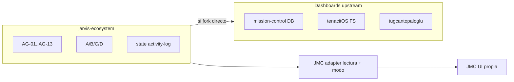

# Forense: dashboards «Mission Control» para OpenClaw → decisión Jarvis Mission Control (JMC)

**Fecha:** abril 2026.  
**Objetivo:** comparar proyectos existentes y **no forkarlos**; extraer ideas para [`JMC_DESIGN.md`](JMC_DESIGN.md).

---

## Repos analizados

| Repo | Stars | Madurez | Stack | Qué adoptamos (ideas) | Qué descartamos |
|------|-------|---------|-------|----------------------|-----------------|
| [abhi1693/openclaw-mission-control](https://github.com/abhi1693/openclaw-mission-control) | ~3.8k | Alta | FastAPI + Postgres + Next + Docker | Multi-org / approvals como **roadmap v2**; API-first | Postgres propio; approvals duplicados vs AG-01..AG-13 |
| [carlosazaustre/tenacitOS](https://github.com/carlosazaustre/tenacitOS) | ~1.2k | Baja (pocos commits) | Next.js 15, lee `~/.openclaw/` | Áreas UX: agents, costs, cron, activity; monitor VPS | Lectura directa `.openclaw`; **editor de memoria** rompe `memory-store` |
| [tugcantopaloglu/openclaw-dashboard](https://github.com/tugcantopaloglu/openclaw-dashboard) | ~658 | Media | HTML/Node | Auth fuerte, TOTP MFA, rate-limit, costes desde SQLite | Acoplarse a su modelo de datos |
| [karem505/openclaw-agent-dashboard](https://github.com/karem505/openclaw-agent-dashboard) | ~46 | Baja | Vanilla single-file | Glassmorphic minimal como referencia estética | Kanban propio sin dossiers Jarvis |
| [boydfd/claw-Agent-dashboard](https://github.com/boydfd/claw-Agent-dashboard) | ~26 | Baja | Python + Vue | Change detector + chat sesión → **v3** tras AG | Escritura workspace sin gates |

---

## Diagrama: cerebro Jarvis vs dashboards externos

**Decisión:** el cerebro sigue en Markdown + skills + `state/`. JMC **lee** el repo y expone JSON `/v1/`; la escritura HTTP está **limitada** a actualizar el modo de autonomía en `~/.openclaw/.env` (Bearer) y al **buzón Chat** acotado en `state/jmc-inbox/` (`POST /v1/chat/*`, adjuntos y metadatos capados). **No** se mutan `state/tasks`, dossiers ni `openclaw.json` desde la web salvo esas rutas explícitas.

---

## Conclusión

- **No** adoptar mission-control de abhi1693 como dependencia (segunda fuente de verdad).
- **No** clonar tenacitOS como runtime interno.
- **Sí** construir **JMC** (`jmc/adapter` + `jmc/ui`) con contrato versionado y bind `127.0.0.1`.

Enlaces internos: [`JMC_DESIGN.md`](JMC_DESIGN.md), [`JMC_OPERACION.md`](JMC_OPERACION.md).

---

## Hallazgos ola 2 (re-forense, abril 2026)

- **Regresión corregida:** comparación del secreto en `POST /v1/webhooks/inbound/*` pasa de nuevo por comparación **timing-safe** (`const_time_str_eq`) frente a `X-JMC-Inbound-Secret`.
- **Lockout inbound:** misma ventana / umbral que Bearer (`JMC_AUTH_FAIL_MAX` / `JMC_AUTH_FAIL_WINDOW`) con clave interna por IP `inbound:<ip>`; el cliente puede consultar `inbound_locked`, `inbound_fails`, `inbound_retry_after_sec` en `GET /v1/auth/status`.
- **Filtrado:** `mirror_result` sin `path`/`stderr`/`stdout` persistidos ni expuestos; fallos de `activity-log` no devuelven `stderr` al envelope del chat.
- **Webhook saliente:** el host de `JMC_WEBHOOK_URL` se valida contra IPs privadas / loopback (como healthchecks externos); opt-in local con `JMC_WEBHOOK_ALLOW_LOCAL=1`.
- **CSP / API base:** la UI mantiene `connect-src` estricto; uso con API en otro host requiere **mismo origen** (reverse proxy) o ajuste explícito de CSP — ver [`JMC_OPERACION.md`](JMC_OPERACION.md).

---

## Deuda técnica conocida (post-auditoría)

- **UI:** `jmc/ui/app.js` concentrado; conviene **split por vista** (`views/chat.js`, `views/tasks.js`, …) en un refactor dedicado con pruebas manuales de pestañas y `localStorage`.
- **CSP estricta:** la UI usa estilos inline en varios sitios; pasar a CSP sin `unsafe-inline` implica mover estilos a hojas o tokens CSS.
- **Tipado estático:** endurecer **mypy** en el adapter (hoy pragmático).
- **SSRF / healthchecks:** validación más fuerte para `JMC_EXT_HEALTHCHECKS` (p. ej. DNS rebinding) si se expone el adapter más allá de loopback.

---

## Referencia

- Buzón chat operativo: [`JMC_CHAT_INBOX.md`](JMC_CHAT_INBOX.md).
