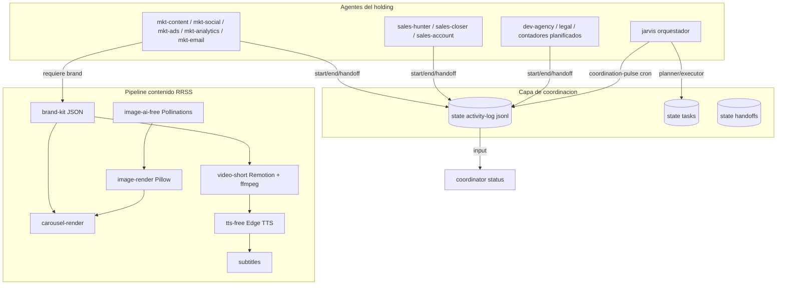

# Propuesta de mejora integral — Jarvis Ecosystem v2

**Fecha:** abril 2026
**Estado:** propuesta aprobada y en implementacion
**Alcance:** coordinacion entre agentes + activity log + pipeline de produccion para redes sociales (carruseles + video corto 30-60s) con stack 100% gratis y local.

---

## 1. Diagnostico del estado actual

### 1.1 Coordinacion: documental, no automatica

Hoy los agentes solo se enteran de lo que hace otro si alguien lo escribe en Trello, Notion, `MEMORY.md` o el dossier del cliente. No existe:

- Log unificado de actividad por agente.
- Handoffs estructurados (JSON) entre roles.
- Mecanismo automatico que detecte "tarea sin movimiento" o "handoff pendiente".
- Validacion de que el dossier del cliente este creado antes de operar sobre el.

Referencias del estado actual: [GOBIERNO_JARVIS_V2.md](GOBIERNO_JARVIS_V2.md), [COMPANIES.md](../COMPANIES.md), [CLIENT_DOSSIER_SCHEMA.md](CLIENT_DOSSIER_SCHEMA.md), [FLUJO_TRELLO_ECOSISTEMA.md](FLUJO_TRELLO_ECOSISTEMA.md).

### 1.2 Marketing: piezas dispersas, sin pipeline de produccion

Existen skills aislados (`carousel-ops`, `canva`, `copywriting-ops`, `seo-audit-ops`, `page-cro-ops`, `video-frames`) y guias [CAROUSEL_IG_JARVIS.md](CAROUSEL_IG_JARVIS.md), pero **no hay pipeline reproducible** para producir Reels/TikToks 30-60s ni generar imagen vertical de calidad. `video-frames` solo extrae frames, no compone.

### 1.3 OpenClaw: multi-agente sin "Agent Teams"

OpenClaw soporta agentes aislados con `agents.list` + `bindings` (routing por canal/cuenta/peer) y `IDENTITY.md`/`SOUL.md`/`AGENTS.md`/`USER.md`/`MEMORY.md` por workspace. **El RFC "Agent Teams"** (comunicacion directa, tareas compartidas con dependencias) **no esta shipped** todavia. Hay que construir la capa de coordinacion encima.

Fuentes:
- [docs.openclaw.ai/multi-agent](https://docs.openclaw.ai/multi-agent)
- [clawdocs.org/guides/multi-agent](http://clawdocs.org/guides/multi-agent)
- [openclaw-openclaw.mintlify.app/configuration](https://openclaw-openclaw.mintlify.app/configuration)

---

## 2. Investigacion: como hacen las "agencias con agentes IA"

Cuatro proyectos comparados como inspiracion estructural (no se copia codigo). Resumen detallado en [RESEARCH_AGENCIAS_AI.md](RESEARCH_AGENCIAS_AI.md).

| Proyecto | Que aprovechar | Que no replicar |
|---|---|---|
| [TheCMOAI/Agents4Marketing](https://github.com/TheCMOAI/Agents4Marketing) | Estructura por agente con 5 piezas: identity + rules + workflow + quality checklist + decision-tree playbook + base de conocimiento compartida | Diez agentes especialistas hiperverticales (Google Ads, Meta Ads, GBP) — fuera de scope inicial |
| [iamevandrake/opensoul](https://github.com/iamevandrake/opensoul) | Heartbeats + delegacion top-down (Director > Strategist > Producer > Creative > Growth > Analyst), budget control, audit trail completo | Stack Paperclip cerrado (no aplica, ya tenemos OpenClaw) |
| [Citedy/adclaw](https://github.com/Citedy/adclaw) | Memoria dual: per-agente (file-based) + AOM (vector compartida); routing `@tag` en Telegram; coordinator que sintetiza y delega | 118 skills a la vez (excesivo) y backend FastAPI/React (no nuestra stack) |
| [ericosiu/marketing-os-starter](https://github.com/ericosiu/marketing-os-starter) | **Handoffs JSON con `schemas/`** rigurosos: research → strategy → copy → social. Memory que compounds. Proactive intent routing | Dependencia de Claude Code propietario |

**Sintesis adoptada:** estructura por agente al estilo Agents4Marketing + handoffs JSON al estilo marketing-os-starter + heartbeats/delegacion al estilo opensoul + activity log y coordinator al estilo adclaw.

---

## 3. Decisiones de arquitectura

### 3.1 Coordinacion sobre OpenClaw (sin esperar al RFC Agent Teams)

- Capa propia en `state/`:
  - `state/activity-log.jsonl` — append-only, evento por linea.
  - `state/tasks/<task-id>.json` — estado vigente.
  - `state/handoffs/<handoff-id>.json` — contrato firmado entre agentes.
- Skills en `skills/global/`:
  - `activity-log` (registrar inicio/fin/handoff/evento).
  - `handoff` (crear/aceptar/rechazar segun schemas en `skills/global/handoff/schemas/`).
  - `coordinator` (lee log + tasks + dossiers; responde "quien tiene que", "que esta atrancado", "que dossier esta huerfano").
- Cron de pulso: `automations/jarvis/coordination-pulse.yaml` cada 4h.
- Dossier obligatorio: el primer evento `start` con `dossier_id` falla si el dossier no existe en `client-dossiers/`.

### 3.2 Stack de produccion de contenido — 100% gratis, sin GPU

| Capa | Herramienta | Tipo | Notas |
|---|---|---|---|
| Brand kit | JSON en `client-dossiers/<id>/brand.json` | Local | Paleta, fuentes, logo |
| Imagen plantilla | Pillow (Python) | Local | Texto + brand kit + composicion |
| Imagen generativa fondo | [Pollinations.ai](https://pollinations.ai/) | API gratis sin key | Fallback HuggingFace Inference free tier |
| Carrusel | `carousel-render` propio | Local | 10 slides, formatos IG / Story / Square |
| Voz | [edge-tts](https://github.com/rany2/edge-tts) (Microsoft Edge) | Free, calidad alta | Fallback `piper` local |
| Subtitulos | `srt` programatico desde guion + opcional whisper.cpp | Local | |
| Video corto | [Remotion](https://remotion.dev/) (React + Node) | Free, CPU | Plantillas vertical 9:16 |
| Composicion | `ffmpeg` | Local | Mux audio + video + subs + musica libre |

**Por que NO se usa Seedance / Sora / Veo / Kling:** son propietarios, sin pesos publicos, requieren API de pago ($0.014–$0.30 por segundo de video). Documentacion publica confirma que **Seedance 2.0 es closed-source** y se distribuye solo via servicios comerciales de ByteDance ([fuente](https://www.glbgpt.com/hub/is-seedance-2-0-open-source-truth-about-bytedances-new-video-ai-2026/)).

**Que se descarta intencionalmente** (puede entrar en futuras fases si hay GPU NVIDIA disponible):
- Wan 2.2, LTX-Video, HunyuanVideo, CogVideoX, Mochi 1, AnimateDiff (todos open source pero requieren 8-60GB VRAM y stack ComfyUI).

### 3.3 Coherencia con el ecosistema existente

- No se rompen rutas existentes (`agents/*/skills`, `automations/*`).
- Skills nuevos viven en `skills/global/` (coordinacion) y `skills/` (produccion contenido) — patron ya usado por las skills MK37.
- Se actualizan `CLAWFLOWS.md`, `LESSONS.md`, `agents/jarvis/SOUL.md`, `agents/marketing/AGENTS.md`/`SOUL.md`/`TOOLS.md`.
- Dos approval gates nuevos: `AG-12` (publicar contenido en plataforma) y `AG-13` (uso de imagen/voz/video con IA generativa).

---

## 4. Mapeo de gaps → solucion → ubicacion

| Gap | Solucion | Archivo / skill |
|---|---|---|
| No hay log de actividad | Append-only JSONL + skill | `state/activity-log.jsonl` + `skills/global/activity-log/` |
| Handoffs informales | JSON validados contra schemas | `skills/global/handoff/` con `schemas/*.json` |
| No se sabe "quien hace que" | Coordinator que cruza log + tasks + dossiers | `skills/global/coordinator/` |
| Dossier opcional | Validacion en `activity-log start` | logica en bin de activity-log |
| Marketing sin pipeline carrusel | brand-kit + image-render + carousel-render | `skills/brand-kit/`, `image-render/`, `carousel-render/` |
| Marketing sin imagen IA | Wrapper Pollinations gratis | `skills/image-ai-free/` |
| Marketing sin reels | TTS + subs + Remotion + ffmpeg | `skills/tts-free/`, `subtitles/`, `video-short/`, `video-compose/` |
| Sin orquestacion E2E | Automation pipeline producto | `automations/marketing/content-production-pipeline.yaml` |
| Sin governance de IA generativa | AG-12 + AG-13 | `docs/APPROVAL_GATES.md` |

---

## 5. Diagrama del modelo final

---

## 6. Plan de fases (resumen ejecutable)

| Fase | Entregables clave | Estado |
|---|---|---|
| 0 | 4 docs maestras (esta + coordinacion + pipeline + research) | en curso |
| 1 | activity-log + handoff + schemas | **hecho** |
| 2 | coordinator + cron pulse + dossier obligatorio | **hecho** |
| 3 | brand-kit + image-render + image-ai-free + carousel-render | **hecho** |
| 4 | tts-free + subtitles + video-short + video-compose | **hecho** (video-short parcial v0.5) |
| 5 | Pipeline orquestado + AG-12/AG-13 + actualizaciones de docs | **parcial** — `approval-gate`, `mkt-publish`, dispatcher, heartbeats plantilla (jul 2026); cron runtime requiere OK CEO |
| 6 | Demo end-to-end (1 carrusel + 1 reel) + verificacion | **hecho** (ver `DEMO_PIPELINE_RRSS.md`) |

**Actualización jul 2026:** loop RRSS modo C — ver [MANUAL_RRSS_JARVIS.md](MANUAL_RRSS_JARVIS.md).

---

## 7. Limitaciones honestas

- **Pollinations.ai / HuggingFace free** tienen rate limits y caidas. El skill incluye retry/backoff y cache local en `state/cache/images/`. La calidad de imagen es buena pero no a la altura de Midjourney/Ideogram.
- **Edge TTS** depende del servicio Microsoft Edge sin SLA. Fallback `piper` local. Voces gratuitas son de calidad alta para LATAM (es-ES, es-MX, es-AR, es-VE, es-CO).
- **Remotion** necesita Node + Chromium. Si Chromium no instala, reusar `PLAYWRIGHT_CHANNEL=chrome` (ya documentado en `skills/browser-playwright/SKILL.md`).
- **Musica libre** se descarga manualmente a `assets/music/` con manifiesto de licencia. No se automatiza descarga para evitar problemas de TOS.
- **Generacion de video con IA local** queda fuera (requiere GPU NVIDIA 8GB+ que no esta disponible). El pipeline produce video editorial vertical (slideshow + motion graphics + voz + subs), no clips tipo Sora.

---

## 8. Cumplimiento de licencia

Todos los modulos son codigo propio. Las referencias a [TheCMOAI/Agents4Marketing](https://github.com/TheCMOAI/Agents4Marketing) (MIT), [opensoul](https://github.com/iamevandrake/opensoul) (Apache 2.0 sobre Paperclip), [adclaw](https://github.com/Citedy/adclaw) (MIT) y [marketing-os-starter](https://github.com/ericosiu/marketing-os-starter) (MIT) se usan **solo como inspiracion estructural**.

El antecedente [Jarvis-MK37](https://github.com/FatihMakes/Jarvis-MK37) (CC BY-NC 4.0) ya estaba documentado en [FORENSE_JARVIS_MK37.md](FORENSE_JARVIS_MK37.md). Esta propuesta v2 mantiene la misma politica: ningun byte copiado de fuentes con licencia incompatible.
