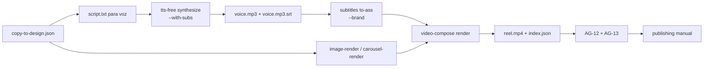

# Pipeline gratis y local — Reels / TikToks

**Status:** v1, abril 2026.
**Costo:** USD 0. **GPU:** no requerida.
**Skills involucradas:** [`brand-kit`](../skills/brand-kit/SKILL.md), [`image-render`](../skills/image-render/SKILL.md), [`carousel-render`](../skills/carousel-render/SKILL.md), [`tts-free`](../skills/tts-free/SKILL.md), [`subtitles`](../skills/subtitles/SKILL.md), [`video-compose`](../skills/video-compose/SKILL.md), [`video-short`](../skills/video-short/SKILL.md) (opcional Remotion).

> Vision general: [PIPELINE_CONTENIDO_RRSS.md](PIPELINE_CONTENIDO_RRSS.md). Para carruseles unicamente: [CAROUSEL_PIPELINE_FREE.md](CAROUSEL_PIPELINE_FREE.md).

---

## 1. Que produce

MP4 H.264 + AAC en formato vertical 1080x1920 (Reels Instagram, TikTok, Shorts YouTube), 30fps, con:

- Slides PNG generados por `image-render` o `carousel-render`.
- Voz IA en español (es-ES, es-AR, es-MX, etc.) via Microsoft Edge TTS.
- Subtitulos quemados (ASS) con tipografia y colores del brand-kit.
- Mezcla opcional con musica de fondo a volumen ducked.
- Manifiesto `index.json` con sha del MP4 y declaracion de `ai_used`.

```
out/<brand_id>/<slug>/
├── reel.mp4
└── index.json
```

## 2. Stack 100% gratis y elegido

| Capa | Herramienta | Costo | GPU | Notas |
|---|---|---|---|---|
| Slides | Pillow (image-render) | 0 | no | reusa carousel-render |
| Voz | Microsoft Edge TTS via `edge-tts` | 0 | no | requiere internet, sin API key |
| Sub timing | edge-tts WordBoundary/SentenceBoundary | 0 | no | SRT real, sin alineacion manual |
| Subs ASS | subtitles to-ass | 0 | no | colores y fuente del brand |
| Musica | archivos locales `assets/music/` | 0 | no | gitignored, opcional |
| Composicion | ffmpeg 6.x | 0 | no | concat + filter_complex + ass burn |
| Animaciones avanzadas | Remotion (opcional) | 0 | no | mas pesado, recomendado solo cuando hace falta |

**Razon de eleccion:** ffmpeg cubre el 90% de Reels educativos / informativos sin costo de mantenimiento. Remotion se reserva para casos con animacion compleja.

## 3. Flujo



## 4. Ejemplo end-to-end (probado)

### 4.1. Generar slides 9:16

```bash
cd /var/www/clawvis-openclaw/jarvis-ecosystem
mkdir -p out/cli-DEMO-rrss/reel-test

for i in 01 02 03 04; do
  jq ".slides[$((10#$i - 1))]" templates/carousels/cli-DEMO-rrss/5-errores-marketing.json > /tmp/slide-$i.json
  bash skills/image-render/bin/image-render slide \
    --brand /home/aipp/Documents/client-dossiers/cli-DEMO-rrss/brand.json \
    --slide /tmp/slide-$i.json \
    --format 1080x1920 \
    --out out/cli-DEMO-rrss/reel-test/slide-$i.png
done
```

### 4.2. Sintetizar voz + obtener SRT

```bash
bash skills/tts-free/bin/tts-free synthesize \
  --text "Hola. Cinco errores comunes en marketing organico. Primero: postear sin escuchar. Segundo: vender en cada post. Tercero: ignorar metricas." \
  --voice es-ES-AlvaroNeural \
  --out out/cli-DEMO-rrss/reel-test/voice.mp3 \
  --with-subs
```

Resultado: `voice.mp3` (~13s) y `voice.mp3.srt` con 3 cues sincronizados.

### 4.3. SRT -> ASS con estilos del brand

```bash
bash skills/subtitles/bin/subtitles to-ass \
  --in out/cli-DEMO-rrss/reel-test/voice.mp3.srt \
  --out out/cli-DEMO-rrss/reel-test/voice.ass \
  --brand cli-DEMO-rrss
```

### 4.4. `reel.json`

```json
{
  "id": "cli-DEMO-rrss-r001",
  "brand_id": "cli-DEMO-rrss",
  "format": "1080x1920",
  "fps": 30,
  "duration_sec": 13,
  "slug": "reel-test",
  "ai_assets": true,
  "slides": [
    { "image": "out/cli-DEMO-rrss/reel-test/slide-01.png", "duration": 3.31 },
    { "image": "out/cli-DEMO-rrss/reel-test/slide-02.png", "duration": 3.31 },
    { "image": "out/cli-DEMO-rrss/reel-test/slide-03.png", "duration": 3.31 },
    { "image": "out/cli-DEMO-rrss/reel-test/slide-04.png", "duration": 3.31 }
  ],
  "audio": {
    "voice": "out/cli-DEMO-rrss/reel-test/voice.mp3"
  },
  "subtitles": {
    "ass": "out/cli-DEMO-rrss/reel-test/voice.ass",
    "burn": true
  }
}
```

### 4.5. Render

```bash
bash skills/video-compose/bin/video-compose render \
  --in out/cli-DEMO-rrss/reel-test/reel.json \
  --out-dir out/cli-DEMO-rrss/reel-test
```

Resultado real medido: `reel.mp4` 1080x1920 H.264 + AAC, 13.2s, 362KB en ~8s de render.

## 5. Voces recomendadas (es-*)

| Voz | Locale | Tono |
|---|---|---|
| `es-ES-AlvaroNeural` | España (M) | natural, broadcast |
| `es-ES-ElviraNeural` | España (F) | calida |
| `es-AR-TomasNeural` | Argentina (M) | local sutil |
| `es-AR-ElenaNeural` | Argentina (F) | local |
| `es-MX-DaliaNeural` | Mexico (F) | comercial |
| `es-MX-JorgeNeural` | Mexico (M) | autoritario |

Lista completa: `tts-free voices --lang es`.

## 6. Recomendaciones de produccion

- **Duracion sweet spot Reels/TikTok:** 30-45s para retencion alta. Hasta 60s funciona si hay valor concreto.
- **Hook en los primeros 3s:** primer slide debe ser el que detiene el scroll.
- **3-5 palabras por linea de subtitulo** maxima legibilidad. Usar `subtitles split-words --max-words 4`.
- **Margen vertical 180px** para que subs no choquen con UI nativa de TikTok/Reels (ya configurado en `to-ass`).
- **Musica:** ducked a 0.15 sobre voz a 1.0 (`audio.music_volume`).

## 7. Limites honestos

- **Sin animaciones complejas** (kinetic typography, motion trails, particle FX) en `video-compose`. Para eso, evaluar `video-short` (Remotion) — esqueleto en este momento.
- **Edge TTS depende de Microsoft.** Si cambian endpoint, requerira upgrade del paquete o fallback a `pyttsx3`/Coqui XTTS local.
- **No upload automatico.** Reels/TikTok no tienen API de publicacion abierta; el ultimo paso es manual.
- **Calidad fonts:** depende de fuentes locales. Para identidad fuerte, poner las TTF en `assets/fonts/`.

## 8. Approval Gates

| Gate | Cuando | Detalle |
|---|---|---|
| **AG-12** | Antes de publicar el reel a un canal externo | [APPROVAL_GATES.md](APPROVAL_GATES.md) |
| **AG-13** | Si voz, fondos o cualquier asset generado por IA | idem |

`index.json.ai_used` queda como marca auditable.

## 9. Roadmap corto

- [ ] Implementar las 3 plantillas Remotion (`five-bullets`, `quote-card`, `step-by-step`).
- [ ] `video-compose render --transition fade|slide|dissolve` con xfade.
- [ ] `tts-free synthesize-script` que lea un JSON con multiples bloques y emita varios mp3 para slides separados.
- [ ] Script `bin/reel-from-carousel` que tome un carousel.json + script.json y genere reel.json automaticamente.

## 10. Integracion con coordinacion

```bash
# Logear inicio
activity-log start --task-id task-2026-04-27-reel \
  --agent marketing --skill video-compose \
  --dossier cli-DEMO-rrss \
  --description "Reel 5 errores marketing organico"

# ... pipeline ...

# Handoff hacia jarvis para revision/AG-12
handoff create \
  --schema producer-to-publisher \
  --from-agent marketing \
  --to-agent jarvis \
  --task-id task-2026-04-27-reel \
  --payload-file out/cli-DEMO-rrss/reel-test/index.json

# Cierre
activity-log end --task-id task-2026-04-27-reel --status completed
```
