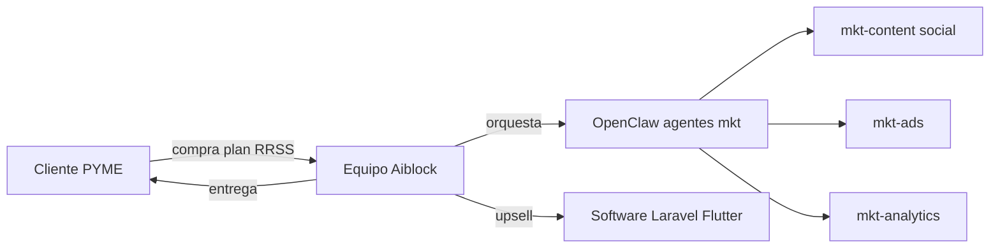

# Modelo de negocio — Unidad Marketing Digital Aiblock (+ OpenClaw)

**Outcome:** canvas, catálogo con precios ancla, unit economics y escenarios Lean/Base/Growth.  
**Marca:** Aiblock · **Motor interno (invisible al cliente):** OpenClaw / Jarvis  
**Fecha:** julio 2026 (rev. precios accesibles) · **Gate precios:** CEO (AG-01/AG-02)  
**Base competitiva:** [01_analisis_competencia_ve.md](01_analisis_competencia_ve.md)

---

## Respuesta corta

Aiblock vende **marketing digital con resultados medibles** (y software como upsell). OpenClaw **no se vende** al cliente: reduce costo por pieza, acelera calendarios y habilita automatización (WA, reportes, research).

**Ticket ancla RRSS (accesible):** Emprende **$290** · Básico **$390** · Pro **$650** · Premium **$890**/mes.  
**Pago:** **solo adelantado** (mes completo **antes** de servir). No hay servicio a crédito: hay que cubrir **IA / APIs / tools**.  
**Descuento referidos (promo limitada):** 5 contrataciones → **10–15%** · vigente hasta **10 oct 2026** (o hasta que CEO la cierre antes).  
**Meta Base (6 meses):** 10–14 clientes activos · ARPU ~$420–$500 · ingreso recurrente ~$4.5k–$7k/mes + one-shot.

---

## 1. Lean Canvas (unidad Marketing)

| Bloque | Contenido |
|--------|-----------|
| **Problema** | PYMEs y emprendedores VE necesitan presencia digital sin tickets de $500+; agencias low-cost dan poco volumen; las caras excluyen a quien arranca. |
| **Segmentos** | 1) Emprendedores bajo recurso ($250–$350/mes) · 2) Comercios Valencia/Carabobo · 3) PYMEs Caracas/remoto · 4) Upsell software |
| **Propuesta única** | “Empieza desde $290/mes, pago adelantado: contenido + embudo WhatsApp + reporte. Promo: trae 5 clientes y ganas 10–15% (hasta 10 oct 2026). Escalas a Pro/Premium cuando el negocio crece.” |
| **Solución** | Planes Emprende/Básico/Pro/Premium · Ads · Branding · Web · Chatbot WA · Email · SEO · Reportería · Software |
| **Canales** | aiblockweb.com · referidos · WhatsApp · IG · outbound · NotebookLM para vendedora |
| **Ingresos** | Retainer · setup · one-shot · fee ads · software |
| **Costos** | Horas humanas · APIs LLM · tools · host OpenClaw |
| **Métricas clave** | Clientes Emprende→upgrade · churn · ARPU · margen · win rate · piezas a tiempo |
| **Ventaja injusta** | OpenClaw + software real + 15+ años · entry accesible sin regalar margen en Pro/Premium |

### Hipótesis a validar (90 días)

1. Emprende a **$290** (36 pubs) cierra ≥40% de leads “bajo presupuesto” con pago adelantado.  
2. ≥25% de Emprende sube a Básico/Pro en 90 días.  
3. La promo referidos (5 contrataciones → 10–15%, hasta 10 oct 2026) genera ≥1 cierre referido por cada 3 clientes activos en el periodo.

---

## 2. Catálogo de servicios y precios (propuesta)

> **Estado:** PROPUESTA — no publicar en web hasta OK CEO.  
> **Ads:** inversión media = del cliente, salvo contrato que diga monto incluido.

### 2.1 Planes mensuales RRSS

| Plan | Publicaciones | Precio ancla | Piso* | Incluye |
|------|---------------|--------------|-------|---------|
| **Emprende** | **36** | **$290**/mes | $250 | 4 videos · 8 feed · 24 historias · embudo WA · reporte simple · **solo orgánico** (sin gestión ads) · **sin visitas** · setup $50 (o **$0** si firma 3 meses) |
| **Básico** | **54** | **$390**/mes | $350 | 6 videos · 10 feed · 38 historias · embudo WA · estudio mercado ligero · **1 visita**/mes (Valencia o remota) · gestión ads **ligera** (media aparte) · reporte mensual · setup $50 (absorbido si 3 meses) |
| **Pro** | **90** | **$650**/mes | $580 | 8 videos · 12 feed · 70 historias · todo lo Básico ampliado · contenido más personalizado · **2 visitas** · 1 sesión estrategia/mes · gestión ads · reporte |
| **Premium** | **102** | **$890**/mes | $800 | 12 videos · 10 feed · 80 historias · todo lo Pro · prioridad producción · 2 sesiones estrategia/mes · reportería avanzada |

\*Debajo del piso → OK CEO obligatorio.

**Comparación vs mercado**

| | Altacom entry | Aiblock Emprende | Montero Online | Aiblock Básico | Montero Est. | Aiblock Pro |
|--|---------------|------------------|----------------|----------------|--------------|-------------|
| Precio | ~$145–$240 | **$290** | $480 | **$390** | $710 | **$650** |
| Volumen | Bajo | **36** | 54 | **54** | 54 | **90** |
| Pago | Variable | **Adelantado** | Mensual | **Adelantado** | Mensual | Mensual |

### 2.2 Add-ons mensuales (IA-enabled)

| Addon | Precio ancla | Qué es |
|-------|--------------|--------|
| **Asistente IA — WhatsApp** | $120/mes | FAQ + captura lead + handoff (no se vende OpenClaw) |
| **Asistente IA — Multicanal** | $150–$220/mes | WA + Instagram DM + Facebook Messenger autónomos · **TikTok solo asistido** (humano con sugerencias IA — sin bot autónomo, riesgo de baneo). Ver [08](08_operacion_entregables.md) §4 |
| **Email marketing** | $80–$150/mes | 2–4 campañas + automatización básica |
| **SEO contenido** | $150–$250/mes | 2–4 artículos/mes |
| **Gestión Ads Pro** | $150–$300/mes fee | Para quien no trae gestión en el plan (p. ej. Emprende) |

> **Regla fija de ads:** la pauta (media) la paga **siempre el cliente directo** en su cuenta publicitaria; Aiblock cobra solo el fee de gestión y **nunca adelanta media** (riesgo cambiario/cobro VE). Detalle en [08](08_operacion_entregables.md) §6.

### 2.3 One-shot (sin cambio en este pase)

| Servicio | Precio ancla | Vs Montero |
|----------|--------------|------------|
| Logo | $380 | Ellos $420 |
| Manual de marca | $280 | Ellos $290 |
| Pack logo + manual | $580 | Ellos $590 |
| Mentoría (1 sesión) | $80 | Ellos $60–150/mes |
| Landing | $450 | Ellos $330 |
| Web corporativa | $750–$1.200 | Ellos $460 |
| Ecommerce / a medida | Desde $1.500 | Ellos $690 (alcance distinto) |

### 2.4 Setup

| Plan | Setup |
|------|-------|
| Emprende | $50 · **$0** si compromiso 3 meses |
| Básico | $50 · absorbido si 3 meses |
| Pro / Premium | $80–$150 o absorbido en Premium según caso |

---

## 2.5 Pagos y negociación (reglas fijas)

| Regla | Detalle |
|-------|---------|
| **Solo adelantado** | El Cliente paga el **mes completo antes** de arrancar producción/publicación. **Sin pago acreditado = no hay servicio.** |
| **Por qué** | Al servir hay costo de **IA, APIs y tools**; no se puede financiar el mes del cliente. |
| **Quincenal / cuotas / “pago después”** | **No aplica.** Eliminado. |
| **Piloto 30 días (Emprende)** | Si se ofrece, también se paga **adelantado** el periodo completo. |
| **Monedas** | USD · Zelle · Bs a tasa del día · USDT |
| **Descuento referidos (promo)** | 5 personas que **contraten** → **10–15%** (vendedora elige % en el rango). **Vigente hasta 10 oct 2026** o hasta que CEO la cierre antes. Después: sin descuento referidos salvo nuevo OK CEO. Debajo de piso o **>15%** = OK CEO. No se mezcla con Fundadores. |
| **Otros descuentos** | No empujar 5%/setup gratis como regateo. Setup $0 por 3 meses solo si ya está en el plan o OK CEO. |
| **Piso** | Vendedora no cierra bajo piso; debajo = CEO |

**Frase vendedora:**  
“Emprende es $290/mes, pago adelantado (así cubrimos la producción desde el día 1). Promo hasta el 10 de octubre: si me traes 5 personas que contraten, 10–15% de descuento.”

---

## 3. Unit economics (estimación operativa)

| Concepto | Emprende | Básico | Pro | Premium |
|----------|----------|--------|-----|---------|
| Precio ancla | $290 | $390 | $650 | $890 |
| Horas humanas/mes | 10–14 h | 14–18 h | 24–30 h | 32–40 h |
| Costo hora blended | $8–$12 | $8–$12 | $8–$12 | $8–$12 |
| Costo humano | $80–$170 | $110–$220 | $220–$360 | $300–$480 |
| APIs + tools | $10–$25 | $15–$35 | $25–$55 | $35–$70 |
| **Costo total ~** | **$90–$195** | **$125–$255** | **$245–$415** | **$335–$550** |
| **Margen ~** | 30–65% | 35–65% | 35–60% | 35–60% |
| **Piso** | $250 | $350 | $580 | $800 |

OpenClaw permite margen viable en Emprende al **bajar volumen**, no al regalar 70 piezas baratas.  
**Regla:** no cerrar bajo piso sin CEO.

**Costo de servir el compromiso 90 días:** todo cliente con compromiso lleva el asistente en modo **"captura y cuenta"** (registra interesados para baseline y reporte, aunque no responda solo). Ese costo (~API + setup ligero) se absorbe en el plan — es lo que hace defendible el compromiso sin discusión al día 90. Ver [08](08_operacion_entregables.md) §5.

---

## 4. Escenarios (scenario-analysis-ops)

**Semilla:** ¿Qué pasa si Aiblock ancla Emprende $290 / Básico $390 / Pro $650 / Premium $890 con **pago adelantado** por defecto?

### Variables

| Variable | Lean | Base | Growth |
|----------|------|------|--------|
| Clientes activos M6 | 6 | 12 | 20 |
| Mix | 60% Emprende / 25% Básico / 15% Pro+ | 40/30/20/10 | 25/30/30/15 |
| ARPU RRSS | $320 | $450 | $580 |
| Upgrade Emprende→Básico+ | 10% | 25% | 35% |
| Churn mensual | 10% | 6% | 4% |

### Resultados estimados (mes 6)

| Escenario | Retainer ~ | Extra ~ | Total ~ | Riesgo |
|-----------|------------|---------|---------|--------|
| **Lean** | $1.9k | $0.4k | **~$2.3k** | Mucho Emprende, poco upgrade |
| **Base** | $5.4k | $1.2k | **~$6.6k** | Capacidad + referidos |
| **Growth** | $11.6k | $3k | **~$14.6k** | Capacidad producción |

### Matriz de riesgos

| Riesgo | Prob. | Impacto | Mitigación |
|--------|-------|---------|------------|
| Emprende satura equipo | Alta | Alto | Cap de N Emprende + pipelines OpenClaw |
| Cliente Emprende exige volumen Pro | Media | Medio | Battlecard alcance; upgrade path |
| Cliente pide pagar después | Media | Alto | Política fija: sin servicio a crédito |
| Guerra vs Altacom $145 | Alta | Medio | No bajar a $145; vender 36 pubs + embudo WA |
| Ads “incluidas” malentendidas | Media | Alto | Emprende = sin ads; contrato claro |
| Descuentos excesivos | Media | Alto | Solo promo referidos (hasta 10 oct 2026) o Fundadores OK CEO |

### Decisión recomendada

1. Validar Emprende **$290** con **pago adelantado** en 5 cierres.  
2. Empujar upgrade a Básico a los 60–90 días.  
3. Activar promo referidos hasta **10 oct 2026**.  
4. Capacidad: priorizar mix; no más de ~8 Emprende simultáneos sin automatizar más.

---

## 5. Modelo operativo (cómo OpenClaw encaja)

- Cliente habla con **humanos**.  
- OpenClaw acelera producción (invisible).  
- Ventas: kit + NotebookLM.

---

## 6. ICP (cliente ideal)

| Sí | No (por ahora) |
|----|----------------|
| Emprende: presupuesto ~$250–$350/mes (adelantado) | Solo “viral gratis” |
| Básico+: ≥$350/mes o proyecto web ≥$400 | Solo print/gran formato |
| WhatsApp como canal de venta | 100% IA sin revisión humana |
| Pago USD/Zelle/Bs/USDT adelantado | ROAS garantizado sin data |

---

## 7. Próximos pasos de negocio

1. CEO confirma anclas Emprende/Básico/Pro/Premium.  
2. Entrenar vendedora: **solo adelantado** + promo referidos hasta 10 oct 2026.  
3. Medir 30 días: % cierres Emprende, referidos cerrados bajo promo, upgrades.  
4. Publicar en aiblockweb.com solo tras validación.

---

## Checklist review

- [x] Lean Canvas 9 bloques
- [x] Plan Emprende accesible + Básico ajustado
- [x] Solo pago adelantado (sin crédito) · promo referidos hasta 10 oct 2026
- [x] Unit economics + pisos
- [x] Escenarios Lean/Base/Growth
- [x] OpenClaw motor interno (no producto)
