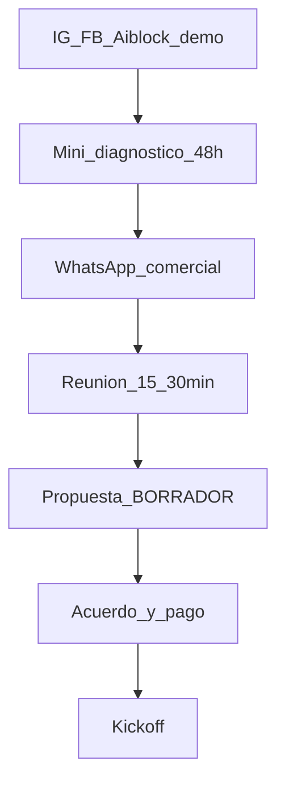

# Plan de marketing y ventas — Agencia Aiblock

**Outcome:** go-to-market para vender el servicio de marketing digital.  
**Marca:** Aiblock · Motor interno: OpenClaw (invisible al cliente)  
**Fecha:** julio 2026  
**Precios:** [02_modelo_negocio.md](02_modelo_negocio.md) · **Kit:** [04_kit_vendedor.md](04_kit_vendedor.md)

---

## Respuesta corta

Vendemos un sistema para **que el negocio venda más**: más interesados en WhatsApp, medidos juntos.  
**Gancho:** mini-diagnóstico gratis de Instagram en **48h**.  
**Promesa:** si en **90 días** no hay más conversaciones WA que el baseline, el cliente puede irse.  
**No prometemos:** “garantizamos X ventas / ROAS”.

---

## 1. Posicionamiento

### Pitch central (memorizar)

> “Trabajamos para que te compren más: te llenamos el WhatsApp de interesados y lo medimos juntos. Si en 90 días no ves más conversaciones que hoy, te vas.”

### Tres mensajes de apoyo

| # | Mensaje | Uso |
|---|---------|-----|
| 1 | **Superioridad medible** — más piezas por dólar, calendario en días, reporte puntual, monitoreo de competencia, consistencia (equipo + IA interna) | Vs agencia tradicional / Montero |
| 2 | **Entry accesible** — Emprende $290 o ~$145 quincenal | Bajo recurso / “estoy empezando” |
| 3 | **Humano + IA** — IA acelera producción; humanos definen estrategia y tono | Objeción “contenido genérico” |

### Qué NO decir

- “Garantizamos que aumentarán tus ventas / ROAS.”
- “Te vendemos OpenClaw / un robot / agentes.”
- “Usamos IA, por eso somos mejores” (sin traducir a velocidad, volumen, datos).
- Precios bajo piso sin OK CEO.

### Tabla ofensiva: tradicional vs Aiblock

| Agencia tradicional | Aiblock |
|---------------------|---------|
| 54 piezas por ~$480 | Emprende $290/36 · Básico $390/54 · Pro $650/90 |
| Calendario en 1–2 semanas | Calendario del mes en **días** |
| Reporte cuando se acuerdan | Reporte **mensual puntual** |
| Research “a ojo” | Monitoreo de competencia continuo |
| Si falta el diseñador, se atrasa todo | Producción asistida = más consistencia |
| Diagnóstico lento o de pago | **Mini-diagnóstico gratis en 48h** |

---

## 2. Embudo Aiblock

1. **IG/FB propios** = demo viviente (mín. 12 piezas/mes, embudo a WA Aiblock).  
2. **Lead magnet:** mini-diagnóstico gratis 48h (handle IG del prospecto).  
3. **WhatsApp comercial** → reunión.  
4. **Propuesta** (plantilla 03) → **acuerdo** (07) → pago → kickoff.

### Mini-diagnóstico 48h (qué incluye)

Entregar PDF/WA corto con:

1. 3 fortalezas de la cuenta  
2. 3 gaps (bio, CTA, consistencia, creatividades)  
3. 1 oportunidad rápida (próximos 7 días)  
4. CTA: “Si quieres, te armo el plan Emprende/Básico con números”

**Ops:** brief a Fady/Luis + OpenClaw (research/copy). SLA: **48h hábiles** desde que el prospecto pasa el @handle.

---

## 3. Campaña 90 días

### Fase 1 — Semanas 1–3 (fundación)

| Acción | Dueño | Meta |
|--------|-------|------|
| Activar calendario IG Aiblock (12+ piezas/mes) | Marketing + OpenClaw | Cuenta viva |
| Cerrar **3 Clientes Fundadores** | Vendedora + CEO | 3 contratos |
| Plantilla diagnóstico + flujo WA | Ops + vendedora | Listo para F2 |
| One-pager + acuerdo en uso | Vendedora | 100% propuestas con docs |

### Fase 2 — Semanas 4–8 (prospección)

| Acción | Meta |
|--------|------|
| Contactos WA outbound / sem | **20** |
| Diagnósticos 48h entregados / sem | **5** |
| Reuniones / sem | **3–4** |
| Propuestas / sem | **2** |
| Cierres tarifa plena (acumulado F2) | **≥2** |

### Fase 3 — Semanas 9–12 (prueba social)

| Acción | Meta |
|--------|------|
| Publicar 2–3 casos (métricas WA mes 1 vs actual) | Con permiso fundadores |
| Carrusel “tradicional vs Aiblock” en IG | 1 pieza hero |
| Ritmo contactos | Mantener 20/sem |
| Upgrades Emprende → Básico | ≥1 |

---

## 4. Canales y piezas

| Canal | Rol |
|-------|-----|
| WhatsApp outbound | Prospección + diagnóstico + cierre |
| IG / FB Aiblock | Demo + inbound suave |
| Referidos | Pedir a fundadores y clientes |
| LinkedIn (Renny) | B2B / consultoría |
| aiblockweb.com | Credibilidad (precios cuando CEO OK) |

**Piezas a producir (ops):**

1. One-pager (03)  
2. Plantilla diagnóstico 48h  
3. Carrusel “tradicional vs Aiblock”  
4. Guiones WA (04)  
5. Testimonios / métricas fundadores (F3)  
6. Acuerdo (07)

---

## 5. Metas y KPIs (90 días)

| KPI | Meta mes 3 |
|-----|------------|
| Clientes Fundadores activos | **3** |
| Clientes tarifa plena | **≥2** |
| Diagnósticos entregados (acum.) | **≥40** |
| Win rate propuestas | 15–25% (aprender) |
| Mora quincenal | &lt;10% de cuotas |
| Upgrades Emprende→Básico+ | ≥1 |
| Piezas IG Aiblock / mes | ≥12 |

**Baseline por cliente (obligatorio en kickoff):** nº aproximado de conversaciones WA / semana **antes** de Aiblock (para el compromiso 90 días).

---

## 6. Programa Clientes Fundadores

### Criterios

- Rubro visible (comercio, servicio, local Valencia o remoto con IG activo)  
- Dispuesto a **testimonio** y a compartir métricas (anonimizado si pide)  
- Puede pagar al menos **piso** del plan (Emprende $250 o Básico $350)  
- Responde WhatsApp (sin eso el sistema no se mide)

### Oferta (solo con OK CEO)

- Precio **piso** del plan elegido  
- **Setup gratis**  
- Compromiso **3 meses**  
- Mismo alcance del plan (no regalar Pro a precio Emprende)

### Contrapartida del cliente

- Permiso escrito para publicar métricas / testimonio  
- 2–3 referidos en 90 días  
- Feedback mensual 15 min

### Cupo

**Máximo 3** fundadores. Luego solo tarifa ancla.

---

## 7. Asistente WhatsApp (puente a ventas)

En el pitch (no solo “addon al final”):

> “No solo te llevamos gente al WhatsApp: con el asistente respondemos al instante, capturamos el dato y te avisamos — para que no se te escape ningún interesado.”

| Plan | Cómo presentarlo |
|------|------------------|
| Emprende | Addon recomendado $120–$180 si el volumen de mensajes sube |
| Básico+ | Incluir en propuesta si el dolor es “no alcanzo a responder” |

---

## 8. Roles

| Rol | Responsabilidad GTM |
|-----|---------------------|
| Vendedora | Contactos, diagnóstico pedido, reuniones, propuestas, seguimiento |
| CEO | OK fundadores, precios bajo piso, cierre grande |
| Luis / Fady | Producción, diagnóstico 48h, calendario cliente e IG Aiblock |
| Renny | Consultoría / LinkedIn / cierres estratégicos |
| OpenClaw (interno) | Acelerar copy, research, borradores de reporte y diagnóstico |

---

## 9. Checklist de arranque (semana 0)

- [ ] Pitch central memorizado por vendedora  
- [ ] One-pager + kit + FAQ + acuerdo listos  
- [ ] Flujo diagnóstico 48h acordado con ops  
- [ ] Lista 30 prospectos ICP  
- [ ] Calendario IG Aiblock mes 1 aprobado  
- [ ] Cupo 3 fundadores abierto (CEO)

---

## Checklist review

- [x] Pitch + qué no decir  
- [x] Embudo + diagnóstico 48h  
- [x] Campaña 90 días  
- [x] KPIs  
- [x] Clientes Fundadores  
- [x] Puente WA IA
