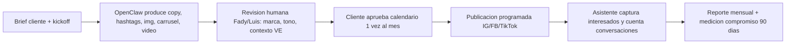

# Operación y entregables — Aiblock Marketing (interno)

**Outcome:** definir qué se entrega de verdad por plan, quién produce, quién revisa y cómo se mide. Este doc manda sobre cualquier promesa comercial: **si no está aquí, no se vende**.  
**Marca:** Aiblock · **Motor interno (invisible al cliente):** OpenClaw  
**Fuentes hermanas:** [02 modelo](02_modelo_negocio.md) · [03 cliente](03_material_cliente.md) · [04 kit](04_kit_vendedor.md) · [06 GTM](06_plan_marketing_ventas.md)  
**Fecha:** julio 2026

---

## Respuesta corta

OpenClaw produce **copys, hashtags, imágenes, carruseles y videos editados**; el humano (Fady/Luis) revisa marca y contexto VE antes de que el cliente apruebe; el **asistente IA multicanal** atiende IG + FB + WhatsApp (TikTok en modo asistido) y **cuenta las conversaciones** que sostienen el compromiso 90 días. La pauta de ads la paga **siempre el cliente**; Aiblock cobra solo el fee de gestión.

---

## 1. Matriz capacidad OpenClaw ↔ entregable por plan

| Capacidad OpenClaw | Emprende $290 | Básico $390 | Pro $650 | Premium $890 |
|--------------------|---------------|-------------|----------|--------------|
| Copys + hashtags | Sí (36 piezas) | Sí (54) | Sí (90) | Sí (102) |
| Imágenes / creatividades | Sí | Sí | Sí | Sí |
| Carruseles | Sí (dentro de feed) | Sí | Sí | Sí |
| Videos **editados** (material del cliente + motion/IA) | 4/mes | 6/mes | 8/mes | 12/mes |
| Video con **captura en visita** (rostro, local, producto) | — | Con la 1 visita/mes | Con las 2 visitas/mes | Con las 2 visitas/mes |
| Calendario mensual aprobado | Sí | Sí | Sí | Sí |
| Asistente IA multicanal | Addon | Addon | Addon (recomendado) | Addon (recomendado) |
| Gestión Facebook/IG Ads | — (addon Gestión Ads) | Ligera (media del cliente) | Sí (media del cliente) | Sí (media del cliente) |
| Reporte | Simple | Mensual | Mensual + sesión | Avanzado + 2 sesiones |
| Monitoreo competencia (research OpenClaw) | — | Ligero | Sí | Sí |

**Regla de venta:** la vendedora solo promete lo que está en esta matriz. Cualquier extra → OK CEO.

---

## 2. Flujo de producción (gate humano obligatorio)

| Paso | Dueño | Regla |
|------|-------|-------|
| Producción de piezas | OpenClaw | Nunca publica directo |
| Revisión de marca/tono/contexto | Fady o Luis | **Obligatoria** antes de mostrar al cliente; un copy con error de contexto VE cuesta el cliente |
| Aprobación de calendario | Cliente | 1 ronda de cambios incluida; extras se acumulan al mes siguiente |
| Publicación | Ops (programada) | Según calendario aprobado |
| Reporte | OpenClaw + revisión humana | Con próximos pasos, no solo métricas |

---

## 3. Definición de "video" por plan (no negociable)

| Tipo | Qué es | Planes |
|------|--------|--------|
| **Video editado** | Reels/clips armados con fotos y videos **que envía el cliente** + motion graphics, IA, música y subtítulos | Todos (Emprende incluido) |
| **Video con captura** | Grabación en el local del cliente durante la visita (rostro, producto, ambiente) | Solo Básico (1 visita) y Pro/Premium (2 visitas) |

**Nunca** prometer producción audiovisual con rostro/locación en Emprende. Si el cliente lo exige → upgrade a Básico o visita puntual cotizada aparte.

---

## 4. Asistente IA multicanal (política de canales)

| Canal | Modo | Por qué |
|-------|------|---------|
| **WhatsApp** | Bot autónomo (FAQ + captura + handoff) | Núcleo del embudo |
| **Instagram DM** | Bot autónomo | API oficial Meta |
| **Facebook Messenger** | Bot autónomo | API oficial Meta |
| **TikTok DM** | **Solo asistido**: humano responde con sugerencias de OpenClaw | Sin API oficial de mensajería; bot autónomo arriesga baneo de la cuenta **del cliente** |

| Nivel addon | Precio ancla | Incluye |
|-------------|--------------|---------|
| WhatsApp solo | $120/mes | Bot WA + captura + handoff |
| **Multicanal** | $150–$220/mes | WA + IG + FB autónomos · TikTok asistido |

**Pitch:** "Que no se te escape nadie: Instagram, Facebook y WhatsApp respondidos al instante."

---

## 5. Medición del compromiso 90 días (instrumento)

El asistente **es** el contador de conversaciones:

1. Todo cliente con compromiso 90 días lleva el asistente al menos en modo **"captura y cuenta"** (registra cada interesado, aunque no responda solo).
2. Kickoff: se anota el **baseline** (conversaciones/semana) con el mismo instrumento.
3. Reporte mensual muestra la curva vs baseline → al día 90 la comparación es automática y sin discusión.
4. Si el cliente rechaza el modo captura, el baseline se mide manualmente (capturas del WA) y se documenta en el acuerdo — más débil, evitarlo.

Costo del modo "captura y cuenta" para clientes con compromiso: se absorbe como costo de servir (ver unit economics en 02).

---

## 6. Regla de Ads (fija)

- La **pauta (media) la paga el cliente directo** en su cuenta publicitaria: tarjeta internacional propia o intermediario.
- Aiblock cobra **solo el fee de gestión** (incluido en Básico ligero / Pro / Premium, o addon Gestión Ads $150–$300 para Emprende).
- **Aiblock nunca adelanta media**: evita riesgo cambiario y de cobro en VE.
- Fricción típica VE: cliente sin tarjeta internacional → orientar a intermediarios de confianza; Aiblock no intermedia el dinero de pauta.

---

## 7. Capacidad y prioridades

| Límite | Valor | Acción al llegar |
|--------|-------|------------------|
| Emprende simultáneos | ~8 | No cerrar más sin automatizar pipelines |
| Diagnósticos 48h en cola | Definir N con ops (arranque: 5/semana) | Se **pausa la prospección fría**, nunca el SLA de 48h |
| IG propio Aiblock | 12 piezas/mes mínimo | No sacrificarlo por clientes: es la demo viviente |

**Orden de prioridad de ops:** 1) clientes activos → 2) SLA diagnósticos 48h → 3) IG propio → 4) prospección extra.

---

## Checklist review

- [x] Matriz OpenClaw ↔ plan
- [x] Gate humano obligatorio antes de publicar
- [x] Video editado vs captura por plan
- [x] TikTok asistido (no bot autónomo)
- [x] Ads: media siempre del cliente
- [x] Asistente como contador del compromiso 90 días
- [x] Límites de capacidad y prioridades
